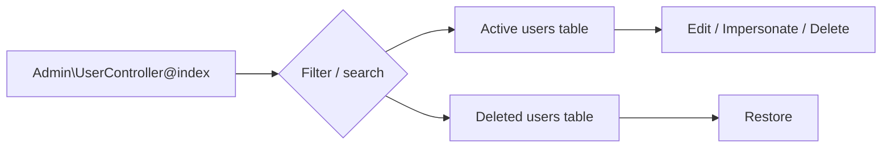
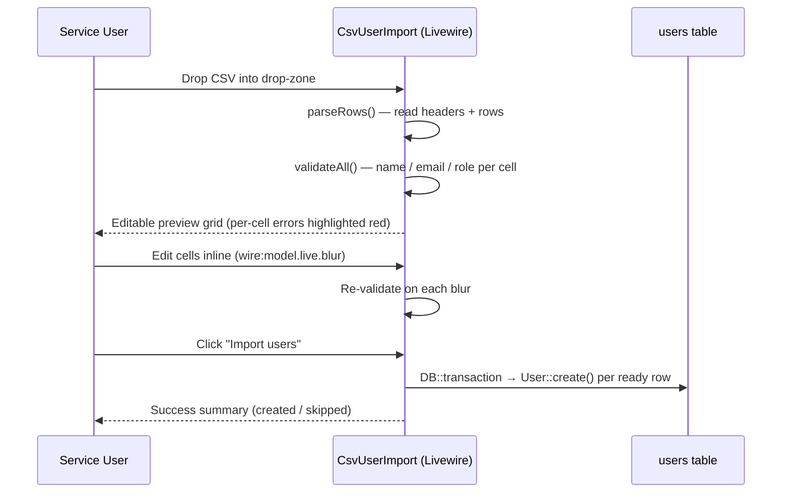
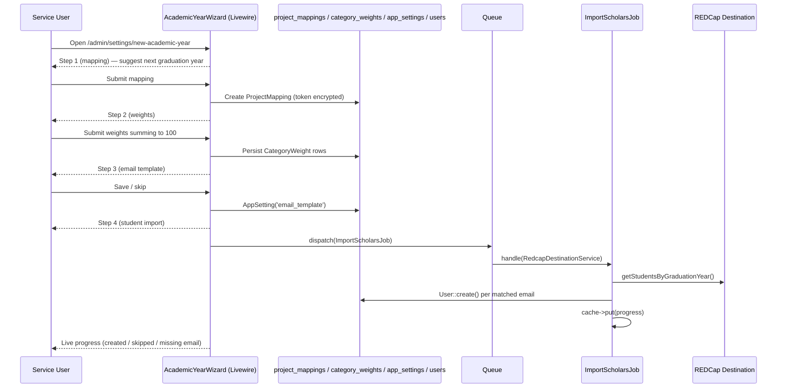

# Admin Features

This guide covers the Service-only administrative surface that lives under `/admin`. None of these features are exposed to Admin, Faculty, or Student roles.

| Feature | Route prefix | Gate | Controller / Component |
|---------|--------------|------|------------------------|
| User management | `/admin/users` | `manage-users` | `Admin\UserController` |
| CSV user import | `/admin/users/import-csv` | `manage-users` | `Livewire\Admin\CsvUserImport` |
| REDCap roster import | `POST /admin/users/import` | `manage-users` | `Admin\UserController@import` |
| Impersonation | `POST /admin/users/{user}/impersonate` | `manage-users` | `Admin\UserController@impersonate` |
| Project-mapping settings | `/admin/settings` | `manage-settings` | `Admin\SettingsController` |
| New academic year wizard | `/admin/settings/new-academic-year` | `manage-settings-records` | `Admin\SettingsController@newAcademicYear` + `<x-admin.⚡academic-year-wizard>` |
| Async student import | dispatched from wizard | `manage-settings-records` | `App\Jobs\ImportScholarsJob` |
| Email-template editor | `<x-⚡email-template-modal>` on `/admin/settings` | `edit-email-template` | `App\Models\AppSetting` (`email_template` key) |
| Docs viewer | `/admin/docs` | `view-docs` | `com-atg/laravel-docs-viewer` (config: `config/docs-viewer.php`) |

---

## User Management

The user index at `/admin/users` lists all roles with role-count KPI tiles, a tab-style filter, and a search box. Soft-deleted users appear in a collapsible "Deleted users" section and can be restored.



**Roles** are persisted via the `App\Enums\Role` enum: `Service`, `Admin`, `Faculty`, `Student`. The role determines which gates pass and which views are accessible.

---

## CSV User Import

Bulk-create Service / Admin / Faculty / Student accounts from a CSV file.

**Entry point:** "Import CSV" button on `/admin/users` → `/admin/users/import-csv` (Livewire component).

### Workflow



### Required CSV format

| Column | Required | Notes |
|--------|----------|-------|
| `name` | yes | Free text |
| `email` | yes | Validated; duplicates against existing users are skipped (warning, not error) |
| `role` | yes | One of `service`, `admin`, `faculty`, `student` (case-insensitive) |

A starter template is downloadable from the import page (`GET /admin/users/import-csv/sample`).

### Validation rules

- **Errors** (red highlight, blocks import) — missing/invalid name, malformed email, invalid role.
- **Warnings** (amber highlight, row will be skipped on import) — email already exists in the `users` table.
- **File-level errors** — file > 1 MB, missing required header columns, malformed CSV.

The import runs inside a single `DB::transaction()` so a partial failure rolls back all created rows.

### Tests

`tests/Feature/CsvUserImportTest.php` covers: valid import, missing headers, per-cell validation, duplicate skipping, transaction rollback, empty file rejection, role normalization.

---

## REDCap Roster Import

`POST /admin/users/import` — pulls every record from the destination REDCap project (`OMMScholarEvalList`) and creates a Student user for each one whose email is not already in the `users` table.

⚠️ Currently runs **synchronously** during the request. For large rosters consider migrating to a queued job mirroring the `process.run` / `process.status` polling pattern (see `Admin\UserController::import()`).

---

## Impersonation

A Service user can act as another user (Admin, Faculty, or Student) to debug what they see.

- **Start:** `POST /admin/users/{user}/impersonate` from the user-row dropdown.
- **Stop:** `POST /impersonate/stop` (always available — its route sits outside the `can:manage-users` gate so the impersonated user can exit even if they lack the gate).
- A persistent banner from `partials/impersonation-banner.blade.php` indicates impersonation is active and offers a "Return to original user" action.
- Impersonation is **session-only**; closing the session ends impersonation.

Service accounts cannot be impersonated, and a user cannot impersonate themselves.

---

## Project-Mapping Settings

`/admin/settings` — Service-only management of `project_mappings` rows. Each mapping pairs a source REDCap project (the per-academic-year evaluation form) with the destination project (`OMMScholarEvalList`). Source API tokens are stored encrypted on the mapping row.

| Action | Route |
|--------|-------|
| List | `GET /admin/settings` |
| New academic year form | `GET /admin/settings/new-academic-year` *(gate: `manage-settings-records`)* |
| Import students for a mapping | `GET /admin/settings/project-mappings/{projectMapping}/import-students` *(gate: `manage-settings-records`)* |
| Process a single mapping | `POST /admin/settings/project-mappings/{projectMapping}/process` |
| Create | `POST /admin/settings/project-mappings` *(gate: `manage-settings-records`)* |
| Edit / Update | `GET|PATCH /admin/settings/project-mappings/{projectMapping}` *(gate: `manage-settings-records`)* |
| Soft delete / Restore | `DELETE` / `POST .../restore` *(gate: `manage-settings-records`)* |

The `manage-settings-records` sub-gate exists so a Service user can trigger processing on existing mappings without granting CRUD on the underlying records.

### New Academic Year Workflow

The setup is a multi-step Livewire wizard published as `<x-admin.⚡academic-year-wizard>`. It walks a Service user through the full annual rotation in one flow:

1. **Project mapping** — academic year (`YYYY-YYYY`), graduation year, REDCap source PID, source API token. Persisted as a `ProjectMapping`; the token is encrypted.
2. **Category weights** — five `CategoryWeight` rows (teaching, clinic, research, didactics, leadership). Validated to sum to 100.
3. **Email template** — optional override of the default evaluation email Blade template; persisted in `app_settings` under the `email_template` key.
4. **Student import** — dispatches `App\Jobs\ImportScholarsJob` to fetch destination students for the graduation year and create missing `Student` users in the background. The wizard polls a cache key for live status.



The legacy synchronous path remains at `GET /admin/settings/project-mappings/{m}/import-students` — useful for re-running an import against an existing mapping. It filters destination REDCap records by graduation year, creates missing `Student` users, and reports skipped existing users plus destination records missing email addresses.

### Async Student Import (`ImportScholarsJob`)

`app/Jobs/ImportScholarsJob.php` is the queued counterpart to the synchronous import.

| Aspect | Detail |
|--------|--------|
| Trigger | Step 4 of the academic-year wizard |
| Inputs | `jobId` (UUID), `projectMappingId` |
| Cache key | `import_scholars:{jobId}` (TTL 60 min) |
| State fields | `status` (pending/running/complete/failed), `total_fetched`, `processed`, `created[]`, `skipped[]`, `missing_email[]`, `error`, `started_at`, `finished_at` |
| Behaviour | Fetches all destination students for the mapping's graduation year, creates `User` rows with `Role::Student` and the matched `redcap_record_id`, skips any email already in `users` (including soft-deleted), records records with no email |

The job clears the `destination:all_students` cache at the start so subsequent dashboard reads hit fresh data.

---

## Email Template Editor

Service users can customize the `EvaluationNotification` email body without redeploying. The default template lives at `resources/views/emails/evaluation.blade.php`; the override is stored in the `app_settings` table under the `email_template` key (see `App\Models\AppSetting`).

| Concern | Where |
|---------|-------|
| Default template | `resources/views/emails/evaluation.blade.php` |
| Override storage | `AppSetting::get('email_template')` |
| Editor UI | `<x-⚡email-template-modal>` on `/admin/settings` |
| Live preview on settings page | `Admin\SettingsController::renderEmailPreview()` (uses dummy Teaching/Category-A data) |
| Used by | `App\Mail\EvaluationNotification::content()` — falls back to the default markdown view when no override is stored |
| Gate | `edit-email-template` (Service-only) |

The modal has two tabs: **Edit** (raw Blade) and **Preview** (renders against the same dummy fixture used for `GET /test/email`). Saving validates by attempting a render; restoring resets the row to the packaged default.

A seeder, `database/seeders/AppSettingSeeder.php`, ensures the `email_template` row exists on first migration so the editor always has a baseline to load.

---

## Docs Viewer

The repository's documentation is browsable inside the app — handy for non-technical Service users who don't have repo access.

| Aspect | Detail |
|--------|--------|
| URL | `/admin/docs` (index) and `/admin/docs/{slug}` (single file) |
| Package | `com-atg/laravel-docs-viewer` |
| Config | `config/docs-viewer.php` — `docs_path = base_path('Docs')`, `readme_path = base_path('README.md')` |
| Middleware | `web`, `RequireSamlAuth`, `can:view-docs` |
| Gate | `view-docs` (Service-only) |
| Published views | `resources/views/vendor/docs-viewer/{index,show}.blade.php` (use the project's `<x-app-shell>`) |
| Markdown styles | `resources/css/docs-prose.css` |

---

## Routes Summary

```
/admin/users                                  GET     index
/admin/users/create                           GET     create
/admin/users                                  POST    store
/admin/users/import                           POST    import (REDCap)
/admin/users/import-csv                       GET     CSV import page
/admin/users/import-csv/sample                GET     starter template
/admin/users/{user}/edit                      GET     edit
/admin/users/{user}                           PATCH   update
/admin/users/{user}                           DELETE  destroy
/admin/users/{id}/restore                     POST    restore
/admin/users/{user}/impersonate               POST    impersonate
/impersonate/stop                             POST    stop impersonation

/admin/settings                               GET     mappings index
/admin/settings/new-academic-year             GET     new academic year setup
/admin/settings/project-mappings              POST    create mapping
/admin/settings/project-mappings/{m}/import-students GET import students for mapping
/admin/settings/project-mappings/{m}/process  POST    process mapping
/admin/settings/project-mappings/{m}/edit     GET     edit mapping
/admin/settings/project-mappings/{m}          PATCH   update mapping
/admin/settings/project-mappings/{m}          DELETE  destroy mapping
/admin/settings/project-mappings/{id}/restore POST    restore mapping

/admin/docs                                   GET     docs index (Service-only)
/admin/docs/{slug}                            GET     rendered markdown (Service-only)
```

All routes above sit inside `Route::middleware(RequireSamlAuth::class)`. Each has its own gate: `can:manage-users` for `/admin/users/*`, `can:manage-settings` (or `can:manage-settings-records` for record-mutating routes) for `/admin/settings/*`, `can:edit-email-template` for the email-template editor, and `can:view-docs` for `/admin/docs/*`.
