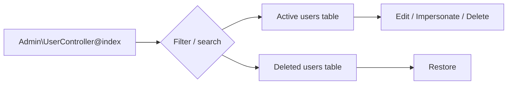
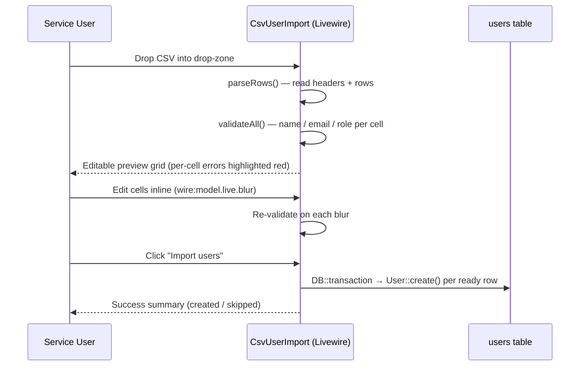

# Admin Features

This guide covers the administrative surface that lives under `/admin`. Service users have full access; Admin users have read-only access to settings and the email-template editor. Faculty and Student roles are blocked at the gate.

| Feature | Route prefix | Gate | Controller / Component |
|---------|--------------|------|------------------------|
| User management | `/admin/users` | `manage-users` (Service) | `Admin\UserController` |
| CSV user import | `/admin/users/import-csv` | `manage-users` (Service) | `Livewire\Admin\CsvUserImport` |
| REDCap roster import | `POST /admin/users/import` | `manage-users` (Service) | `Admin\UserController@import` |
| Impersonation | `POST /admin/users/{user}/impersonate` | `manage-users` (Service) | `Admin\UserController@impersonate` |
| Settings index | `GET /admin/settings` | `manage-settings` (Service, Admin) | `Admin\SettingsController@index` |
| Project-mapping CRUD | `POST/PATCH/DELETE /admin/settings/project-mappings/*` | `manage-settings-records` (Service) | `Admin\SettingsController` |
| New academic-year wizard | rendered on `/admin/settings/source-project/create` | `manage-settings-records` (Service) | `<x-admin.⚡academic-year-wizard>` |
| Async student import | dispatched from wizard | `manage-settings-records` (Service) | `App\Jobs\ImportScholarsJob` |
| Synchronous import re-run | `GET /admin/settings/project-mappings/{m}/import-students` | `manage-settings-records` (Service) | `Admin\SettingsController@importStudents` |
| Activate a mapping | `POST /admin/settings/project-mappings/{m}/activate` | `manage-settings-records` (Service) | `Admin\SettingsController@activate` |
| Email-template editor | inline on `/admin/settings` index | `edit-email-template` (Service, Admin) | `App\Models\AppSetting` (`email_template` key) + `MailTemplateRenderer` |
| Docs viewer | `/admin/docs` | `view-docs` (Service) | `com-atg/laravel-docs-viewer` (config: `config/docs-viewer.php`) |

---

## User Management

The user index at `/admin/users` lists all roles with role-count KPI tiles, a tab-style filter, and a search box. Soft-deleted users appear in a collapsible "Deleted users" section and can be restored.



**Roles** are persisted via the `App\Enums\Role` enum: `Service`, `Admin`, `Faculty`, `Student`. The role determines which gates pass and which views are accessible. Roles are no longer recomputed from env allowlists at login — change a user's role from the edit page.

---

## CSV User Import

Bulk-create Service / Admin / Faculty / Student accounts from a CSV file.

**Entry point:** "Import CSV" button on `/admin/users` → `/admin/users/import-csv` (Livewire component).

### Workflow



### Required CSV format

| Column | Required | Notes |
|--------|----------|-------|
| `name` | yes | Free text |
| `email` | yes | Validated; duplicates against existing users are skipped (warning, not error) |
| `role` | yes | One of `service`, `admin`, `faculty`, `student` (case-insensitive) |

A starter template is downloadable from the import page (`GET /admin/users/import-csv/sample`).

### Validation rules

- **Errors** (red highlight, blocks import) — missing/invalid name, malformed email, invalid role.
- **Warnings** (amber highlight, row will be skipped on import) — email already exists in the `users` table.
- **File-level errors** — file > 1 MB, missing required header columns, malformed CSV.

The import runs inside a single `DB::transaction()` so a partial failure rolls back all created rows.

### Tests

`tests/Feature/CsvUserImportTest.php` covers: valid import, missing headers, per-cell validation, duplicate skipping, transaction rollback, empty file rejection, role normalization.

---

## REDCap Roster Import

`POST /admin/users/import` — pulls every record from the destination REDCap project (`OMMScholarEvalList`) and creates a Student user for each one whose email is not already in the `users` table.

⚠️ Currently runs **synchronously** during the request. For large rosters consider migrating to a queued job mirroring the `process.run` / `process.status` polling pattern (see `Admin\UserController::import()`).

The wizard's `ImportScholarsJob` is the async counterpart used during initial setup; this route is the on-demand re-sync.

---

## Impersonation

A Service user can act as another user (Admin, Faculty, or Student) to debug what they see.

- **Start:** `POST /admin/users/{user}/impersonate` from the user-row dropdown.
- **Stop:** `POST /impersonate/stop` (always available — its route sits outside the `can:manage-users` gate so the impersonated user can exit even if they lack the gate).
- A persistent banner from `partials/impersonation-banner.blade.php` indicates impersonation is active and offers a "Return to original user" action.
- Impersonation is **session-only**; closing the session ends impersonation.

Service accounts cannot be impersonated, and a user cannot impersonate themselves.

---

## Project-Mapping Settings

`/admin/settings` — management of `project_mappings` rows. Each mapping captures a source REDCap project (the per-academic-year evaluation form) along with its API token. Exactly **one** mapping is marked `is_active` at any time; activating another mapping flips the previous one off in the same transaction. Source API tokens are stored encrypted on the mapping row.

| Action | Route | Gate |
|--------|-------|------|
| List | `GET /admin/settings` | `manage-settings` (Service, Admin) |
| New source project (wizard) | `GET /admin/settings/source-project/create` | `manage-settings-records` (Service) |
| Create mapping | `POST /admin/settings/project-mappings` | `manage-settings-records` (Service) |
| Re-run student import for a mapping | `GET /admin/settings/project-mappings/{m}/import-students` | `manage-settings-records` (Service) |
| Edit form | `GET /admin/settings/project-mappings/{m}/edit` | `manage-settings-records` (Service) |
| Update | `PATCH /admin/settings/project-mappings/{m}` | `manage-settings-records` (Service) |
| Activate | `POST /admin/settings/project-mappings/{m}/activate` | `manage-settings-records` (Service) |
| Soft delete | `DELETE /admin/settings/project-mappings/{m}` | `manage-settings-records` (Service) |
| Restore | `POST /admin/settings/project-mappings/{id}/restore` | `manage-settings-records` (Service) |

Admin users hit `manage-settings` (the index gate) for read-only visibility — they can see the active mapping and the email-template editor, but every CRUD action is blocked at `manage-settings-records`.

### New Source Project Workflow

The setup is a 2-step Livewire wizard published as `<x-admin.⚡academic-year-wizard>`. It's rendered at `/admin/settings/source-project/create`:

1. **Project mapping** — REDCap source PID + source API token. On save, the previous active mapping is flipped to `is_active = 0` and the new row is created with `is_active = 1` in a single transaction.
2. **Student import** — once the mapping is saved the wizard dispatches `App\Jobs\ImportScholarsJob` (via `dispatchAfterResponse`), tracks the job under `import_scholars:{jobId}` in the cache, and polls the cache key for live status.

```mermaid
sequenceDiagram
    participant S as Service User
    participant W as AcademicYearWizard (Livewire)
    participant DB as project_mappings / users
    participant Q as Queue
    participant J as ImportScholarsJob
    participant RC as REDCap Destination

    S->>W: Open /admin/settings/source-project/create
    W-->>S: Step 1 — REDCap PID + token
    S->>W: Submit mapping
    W->>DB: Flip previous active off; create new mapping (is_active=1)
    W-->>S: Step 2 — Import students
    S->>W: Click "Start import"
    W->>Q: dispatchAfterResponse(ImportScholarsJob)
    Q->>J: handle(RedcapDestinationService)
    J->>RC: getAllStudentRecords()
    J->>DB: User::create / update per matched email\n(cohort_start_term, cohort_start_year, batch, is_active)
    J->>J: cache->put(progress)
    W-->>S: Live progress (created / updated / missing email)
```

### Synchronous re-run

`GET /admin/settings/project-mappings/{m}/import-students` runs the same import logic in-process and renders `admin.settings.import-students-result`. It clears the `destination:all_students` cache, fetches every destination record, and either creates or updates a `User` row per non-empty email — picking up any cohort changes (`cohort_start_term`, `cohort_start_year`, `batch`, `is_active`) on existing students. Records with no email are reported as `missingEmail[]`.

### Async Student Import (`ImportScholarsJob`)

`app/Jobs/ImportScholarsJob.php` is the queued counterpart used by the wizard.

| Aspect | Detail |
|--------|--------|
| Trigger | Step 2 of the academic-year wizard |
| Inputs | `jobId` (UUID), `projectMappingId` |
| Cache key | `import_scholars:{jobId}` (TTL 60 min) |
| State fields | `status` (pending/running/complete/failed), counts (`total_fetched`, `processed`), `created[]`, `updated[]`, `missing_email[]`, `error`, `started_at`, `finished_at` |
| Behaviour | Fetches the full destination roster, upserts `User` rows with `Role::Student` and the matched cohort metadata, records records with no email |

The job clears the `destination:all_students` cache at the start so subsequent dashboard reads hit fresh data.

---

## Email Template Editor

Service and Admin users can customize the `EvaluationNotification` email body without redeploying. The default template lives at `resources/views/emails/evaluation.blade.php`; the override is stored in the `app_settings` table under the `email_template` key (see `App\Models\AppSetting`).

| Concern | Where |
|---------|-------|
| Default template | `resources/views/emails/evaluation.blade.php` |
| Override storage | `AppSetting::get('email_template')` (forever-cached per key) |
| Editor UI | Inline on `/admin/settings` index — no modal; the form posts back to the same page |
| Live preview | `Admin\SettingsController::renderEmailPreview()` calls `MailTemplateRenderer::render($template, EvaluationNotification::sampleViewData())` |
| Used by | `App\Mail\EvaluationNotification::content()` — falls back to the default markdown view when no override is stored |
| Gate | `edit-email-template` (Service + Admin) |

The settings index page renders the saved template alongside the live preview. Saving validates by attempting a render; restoring resets the row to the packaged default.

A seeder, `database/seeders/AppSettingSeeder.php`, ensures the `email_template` row exists on first migration so the editor always has a baseline to load.

---

## Docs Viewer

The repository's documentation is browsable inside the app — handy for non-technical Service users who don't have repo access.

| Aspect | Detail |
|--------|--------|
| URL | `/admin/docs` (index) and `/admin/docs/{slug}` (single file) |
| Package | `com-atg/laravel-docs-viewer` |
| Config | `config/docs-viewer.php` — `docs_path = base_path('Docs')`, `readme_path = base_path('README.md')` |
| Middleware | `web`, `RequireSamlAuth`, `can:view-docs` |
| Gate | `view-docs` (Service-only) |
| Published views | `resources/views/vendor/docs-viewer/{index,show}.blade.php` (use the project's `<x-app-shell>`) |
| Markdown styles | `resources/css/docs-prose.css` |

---

## Routes Summary

```
/admin/users                                  GET     index
/admin/users/create                           GET     create
/admin/users                                  POST    store
/admin/users/import                           POST    import (REDCap)
/admin/users/import-csv                       GET     CSV import page
/admin/users/import-csv/sample                GET     starter template
/admin/users/{user}/edit                      GET     edit
/admin/users/{user}                           PATCH   update
/admin/users/{user}                           DELETE  destroy
/admin/users/{id}/restore                     POST    restore
/admin/users/{user}/impersonate               POST    impersonate
/impersonate/stop                             POST    stop impersonation

/admin/settings                                       GET     mappings index + email-template editor
/admin/settings/source-project/create                 GET     new source-project wizard view
/admin/settings/project-mappings                      POST    create mapping
/admin/settings/project-mappings/{m}/import-students  GET     re-run synchronous import
/admin/settings/project-mappings/{m}/edit             GET     edit mapping
/admin/settings/project-mappings/{m}                  PATCH   update mapping
/admin/settings/project-mappings/{m}/activate         POST    flip is_active to this mapping
/admin/settings/project-mappings/{m}                  DELETE  destroy mapping
/admin/settings/project-mappings/{id}/restore         POST    restore mapping

/admin/docs                                   GET     docs index (Service-only)
/admin/docs/{slug}                            GET     rendered markdown (Service-only)
```

All routes above sit inside `Route::middleware(RequireSamlAuth::class)`. `/admin/users/*` is gated by `can:manage-users` (Service); `/admin/settings` (index) is gated by `can:manage-settings` (Service + Admin); every settings record-mutating route is sub-gated by `can:manage-settings-records` (Service); the email-template editor section uses `can:edit-email-template` (Service + Admin); and `/admin/docs/*` is gated by `can:view-docs` (Service).
