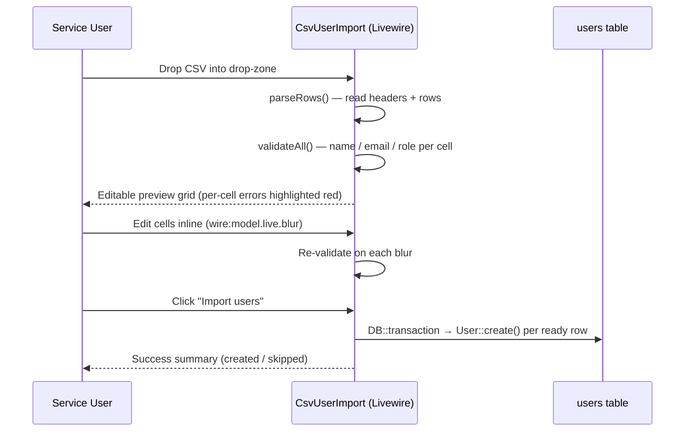
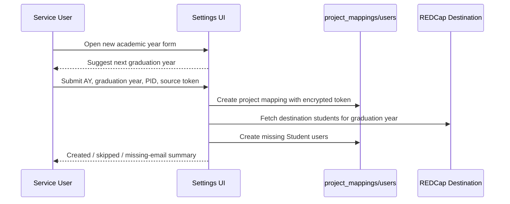

# Admin Features

This guide covers the Service-only administrative surface that lives under `/admin`. None of these features are exposed to Admin, Faculty, or Student roles.

| Feature | Route prefix | Gate | Controller / Component |
|---------|--------------|------|------------------------|
| User management | `/admin/users` | `manage-users` | `Admin\UserController` |
| CSV user import | `/admin/users/import-csv` | `manage-users` | `Livewire\Admin\CsvUserImport` |
| REDCap roster import | `POST /admin/users/import` | `manage-users` | `Admin\UserController@import` |
| Impersonation | `POST /admin/users/{user}/impersonate` | `manage-users` | `Admin\UserController@impersonate` |
| Project-mapping settings | `/admin/settings` | `manage-settings` | `Admin\SettingsController` |
| New academic year setup | `/admin/settings/new-academic-year` | `manage-settings-records` | `Admin\SettingsController@newAcademicYear` |

---

## User Management

The user index at `/admin/users` lists all roles with role-count KPI tiles, a tab-style filter, and a search box. Soft-deleted users appear in a collapsible "Deleted users" section and can be restored.

```mermaid
flowchart LR
    A[Admin\UserController@index] --> B{Filter / search}
    B --> C[Active users table]
    B --> D[Deleted users table]
    C --> E[Edit / Impersonate / Delete]
    D --> F[Restore]
```

**Roles** are persisted via the `App\Enums\Role` enum: `Service`, `Admin`, `Faculty`, `Student`. The role determines which gates pass and which views are accessible.

---

## CSV User Import

Bulk-create Service / Admin / Faculty / Student accounts from a CSV file.

**Entry point:** "Import CSV" button on `/admin/users` → `/admin/users/import-csv` (Livewire component).

### Workflow



### Required CSV format

| Column | Required | Notes |
|--------|----------|-------|
| `name` | yes | Free text |
| `email` | yes | Validated; duplicates against existing users are skipped (warning, not error) |
| `role` | yes | One of `service`, `admin`, `faculty`, `student` (case-insensitive) |

A starter template is downloadable from the import page (`GET /admin/users/import-csv/sample`).

### Validation rules

- **Errors** (red highlight, blocks import) — missing/invalid name, malformed email, invalid role.
- **Warnings** (amber highlight, row will be skipped on import) — email already exists in the `users` table.
- **File-level errors** — file > 1 MB, missing required header columns, malformed CSV.

The import runs inside a single `DB::transaction()` so a partial failure rolls back all created rows.

### Tests

`tests/Feature/CsvUserImportTest.php` covers: valid import, missing headers, per-cell validation, duplicate skipping, transaction rollback, empty file rejection, role normalization.

---

## REDCap Roster Import

`POST /admin/users/import` — pulls every record from the destination REDCap project (`OMMScholarEvalList`) and creates a Student user for each one whose email is not already in the `users` table.

⚠️ Currently runs **synchronously** during the request. For large rosters consider migrating to a queued job mirroring the `process.run` / `process.status` polling pattern (see `Admin\UserController::import()`).

---

## Impersonation

A Service user can act as another user (Admin, Faculty, or Student) to debug what they see.

- **Start:** `POST /admin/users/{user}/impersonate` from the user-row dropdown.
- **Stop:** `POST /impersonate/stop` (always available — its route sits outside the `can:manage-users` gate so the impersonated user can exit even if they lack the gate).
- A persistent banner from `partials/impersonation-banner.blade.php` indicates impersonation is active and offers a "Return to original user" action.
- Impersonation is **session-only**; closing the session ends impersonation.

Service accounts cannot be impersonated, and a user cannot impersonate themselves.

---

## Project-Mapping Settings

`/admin/settings` — Service-only management of `project_mappings` rows. Each mapping pairs a source REDCap project (the per-academic-year evaluation form) with the destination project (`OMMScholarEvalList`). Source API tokens are stored encrypted on the mapping row.

| Action | Route |
|--------|-------|
| List | `GET /admin/settings` |
| New academic year form | `GET /admin/settings/new-academic-year` *(gate: `manage-settings-records`)* |
| Import students for a mapping | `GET /admin/settings/project-mappings/{projectMapping}/import-students` *(gate: `manage-settings-records`)* |
| Process a single mapping | `POST /admin/settings/project-mappings/{projectMapping}/process` |
| Create | `POST /admin/settings/project-mappings` *(gate: `manage-settings-records`)* |
| Edit / Update | `GET|PATCH /admin/settings/project-mappings/{projectMapping}` *(gate: `manage-settings-records`)* |
| Soft delete / Restore | `DELETE` / `POST .../restore` *(gate: `manage-settings-records`)* |

The `manage-settings-records` sub-gate exists so a Service user can trigger processing on existing mappings without granting CRUD on the underlying records.

### New Academic Year Workflow



Student import for a mapping filters destination REDCap records by `year` or `graduation_year`, creates missing `Student` users, caches each matched `record_id`, and reports skipped existing users plus destination records missing email addresses.

---

## Routes Summary

```
/admin/users                                  GET     index
/admin/users/create                           GET     create
/admin/users                                  POST    store
/admin/users/import                           POST    import (REDCap)
/admin/users/import-csv                       GET     CSV import page
/admin/users/import-csv/sample                GET     starter template
/admin/users/{user}/edit                      GET     edit
/admin/users/{user}                           PATCH   update
/admin/users/{user}                           DELETE  destroy
/admin/users/{id}/restore                     POST    restore
/admin/users/{user}/impersonate               POST    impersonate
/impersonate/stop                             POST    stop impersonation

/admin/settings                               GET     mappings index
/admin/settings/new-academic-year             GET     new academic year setup
/admin/settings/project-mappings              POST    create mapping
/admin/settings/project-mappings/{m}/import-students GET import students for mapping
/admin/settings/project-mappings/{m}/process  POST    process mapping
/admin/settings/project-mappings/{m}/edit     GET     edit mapping
/admin/settings/project-mappings/{m}          PATCH   update mapping
/admin/settings/project-mappings/{m}          DELETE  destroy mapping
/admin/settings/project-mappings/{id}/restore POST    restore mapping
```

All routes above sit inside `Route::middleware(RequireSamlAuth::class)` and either `can:manage-users` or `can:manage-settings`.
