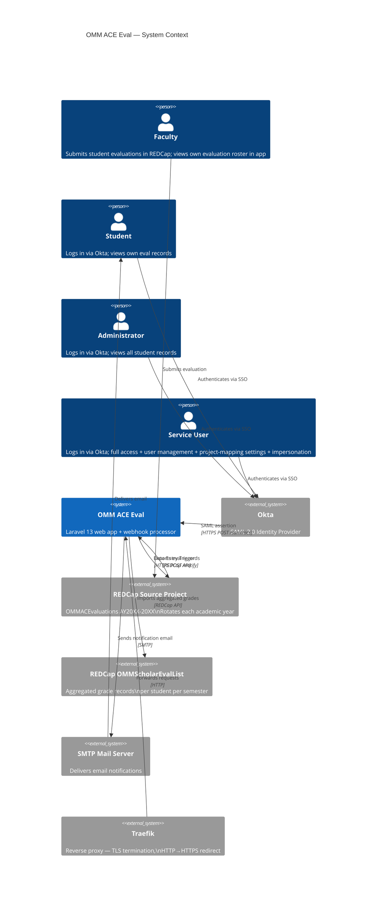
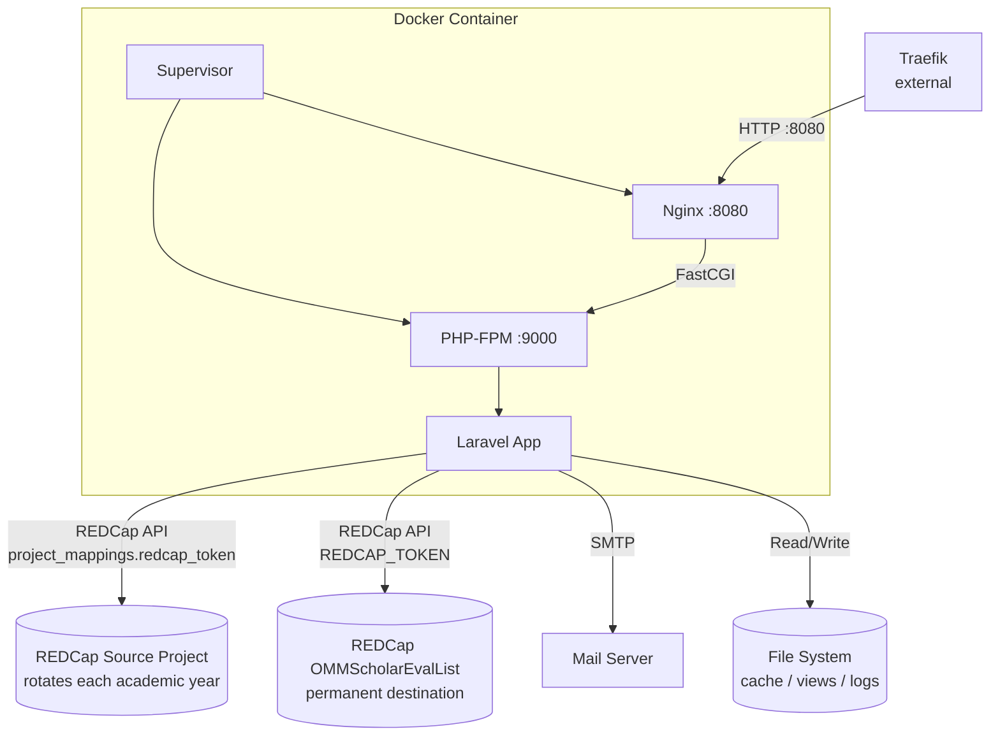
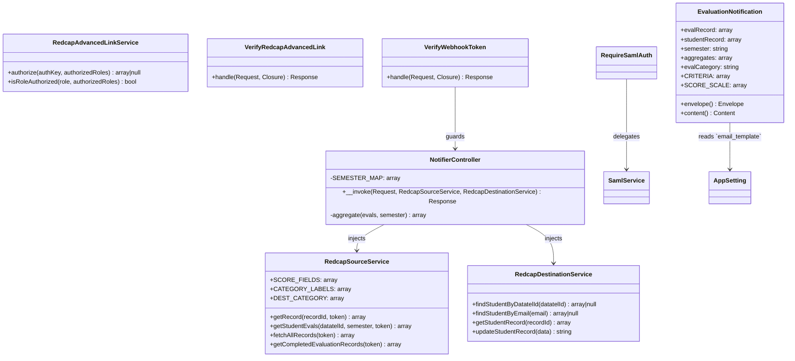
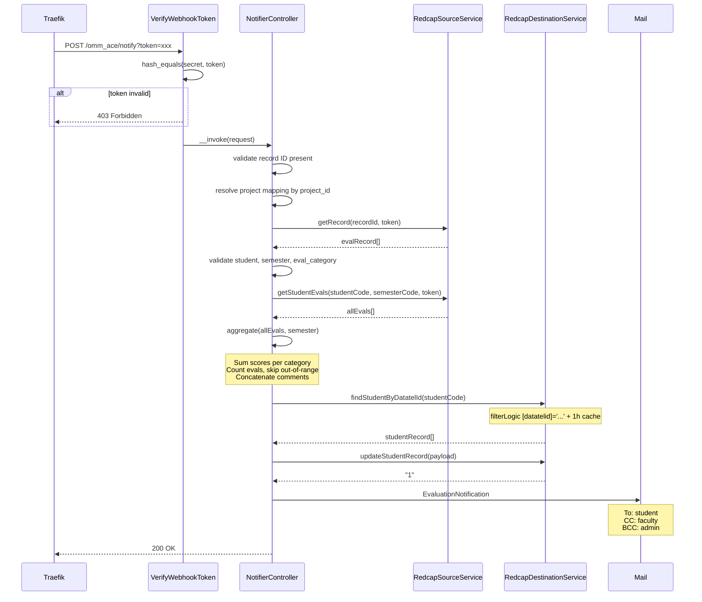
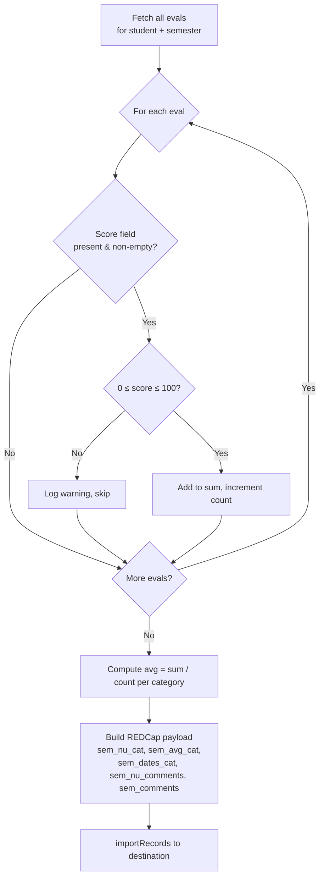
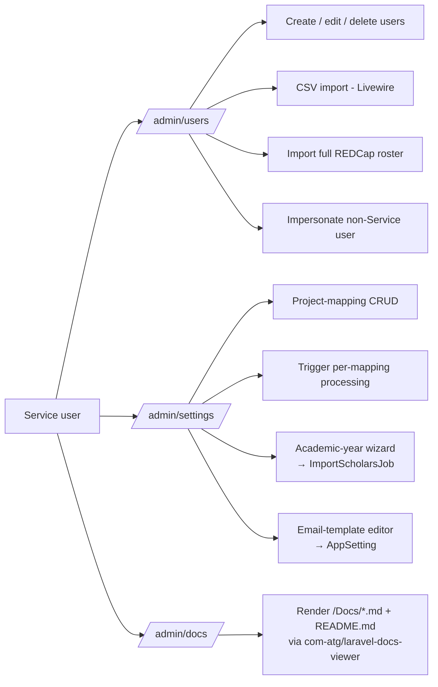

# Architecture

## System Context

The app sits between annual REDCap source projects, a permanent REDCap destination project, an Okta tenant, and a mail server. State is persisted in MySQL (users, project mappings, sessions, cache, queue) and in REDCap (student records, aggregates).

---

## Container Architecture

**Supervisor** manages two processes inside one container:

| Process | Command | Priority |
|---------|---------|----------|
| php-fpm | `php-fpm -F` | 5 (starts first) |
| nginx | `nginx -g "daemon off;"` | 10 |

Bulk processing is dispatched with `dispatchAfterResponse()` and stores progress in the cache. In development, `composer run dev` starts `queue:listen`; production should run a queue worker when `QUEUE_CONNECTION=database`.

---

## Component Breakdown

Other classes worth knowing about (not pictured above):

| Class | Role |
|-------|------|
| `App\Jobs\ImportScholarsJob` | Queued import of destination students for a project mapping; cache-backed progress (`import_scholars:{jobId}`) |
| `App\Jobs\ProcessSourceProjectJob` | Queued bulk re-aggregation of every record in a source project |
| `App\Models\AppSetting` | Key/value store; currently used for the `email_template` override |
| `App\Support\EvalAggregator` | Shared aggregation logic used by `NotifierController`, `ProcessSourceProjectJob`, and `omm:process-source` |
| `App\Support\FinalScoreFormulaParser` | Parses destination REDCap calculated-score formulas to compute final scores |

---

## SAML Authentication Flow

---

## Webhook Request Flow

---

## Aggregation Logic

For each webhook trigger the app re-computes the full semester aggregate from scratch (not incremental), ensuring the destination is always consistent even if earlier records were corrected.

**Category → field mapping:**

| eval_category | Label | Score field | Destination avg field |
|---|---|---|---|
| A | Teaching | `teaching_score` | `{sem}_avg_teaching` |
| B | Clinic | `clinical_performance_score` | `{sem}_avg_clinic` |
| C | Research | `research_total_score` | `{sem}_avg_research` |
| D | Didactics | `didactic_total_score` | `{sem}_avg_didactics` |

**Semester mapping:** `'1'` → `spring`, `'2'` → `fall`

---

## Persistence Design

The application keeps operational state in MySQL and aggregate evaluation data in REDCap:

| Concern | Solution |
|---------|---------|
| Sessions | `SESSION_DRIVER=database` — `sessions` table in MySQL |
| Cache | `CACHE_STORE=database` — `cache` table; destination roster cached 10 min, per-student lookup 1 h, process & student-import status 60 min |
| Queue | `QUEUE_CONNECTION=database` — `jobs` table; `ProcessSourceProjectJob` dispatched after response, `ImportScholarsJob` dispatched from the academic-year wizard |
| Migrations | `users`, `project_mappings`, `category_weights`, `app_settings`, `sessions`, `cache`, `jobs`, `password_reset_tokens` |
| Persistence | User records (with roles + REDCap record IDs), project mappings, category weights, and app settings (e.g. custom email template) in MySQL; aggregated grades in REDCap |

User authentication state is stored in the database-backed session. The `users` table caches each student's `redcap_record_id` after their first SAML login, avoiding a REDCap API call on every request.

---

## Admin Surface

In addition to the webhook and student/faculty views, the app exposes a Service-only admin surface:

See [Admin Features](admin-features.md) for routes, gates, validation rules, and the CSV import workflow.

**Gates** (defined in `AppServiceProvider`):

| Gate | Allowed roles |
|------|---------------|
| `view-dashboard` | Service, Admin, Faculty |
| `view-student-page` | Service, Admin, Student (own record only) |
| `view-all-students` | Service, Admin |
| `view-faculty-detail` | Service, Admin, Faculty |
| `run-process` | Service |
| `manage-users` | Service |
| `manage-settings` | Service |
| `manage-settings-records` | Service (sub-gate for project-mapping CRUD vs. process-only) |
| `edit-email-template` | Service (`<x-⚡email-template-modal>` on `/admin/settings`) |
| `view-docs` | Service (`/admin/docs` documentation viewer) |
