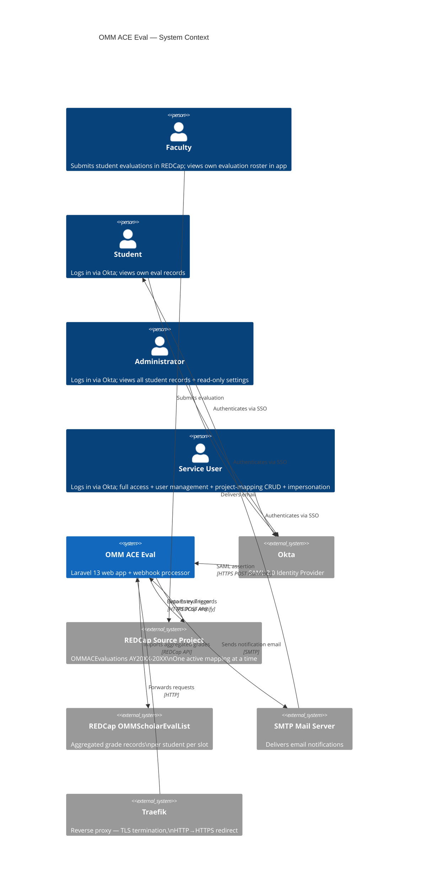
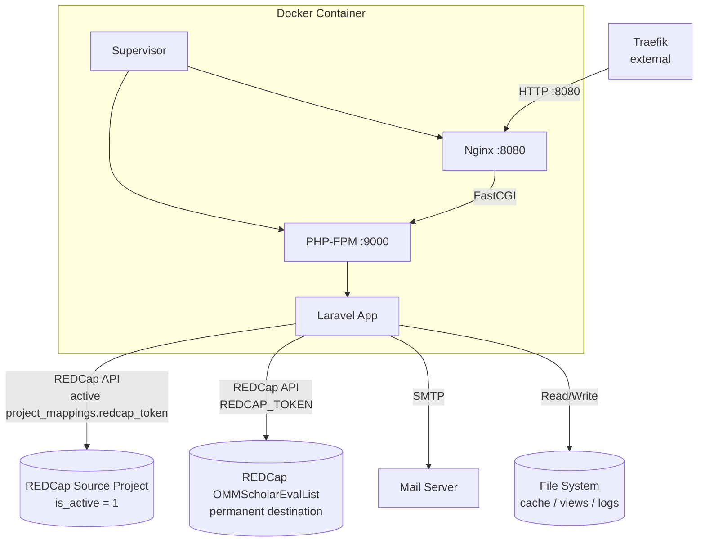
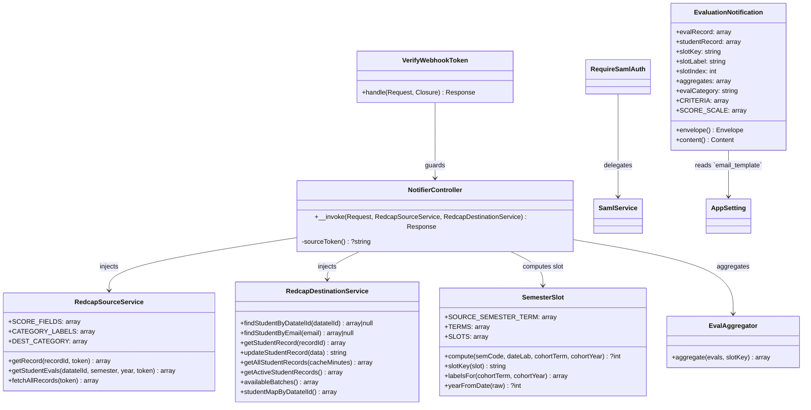
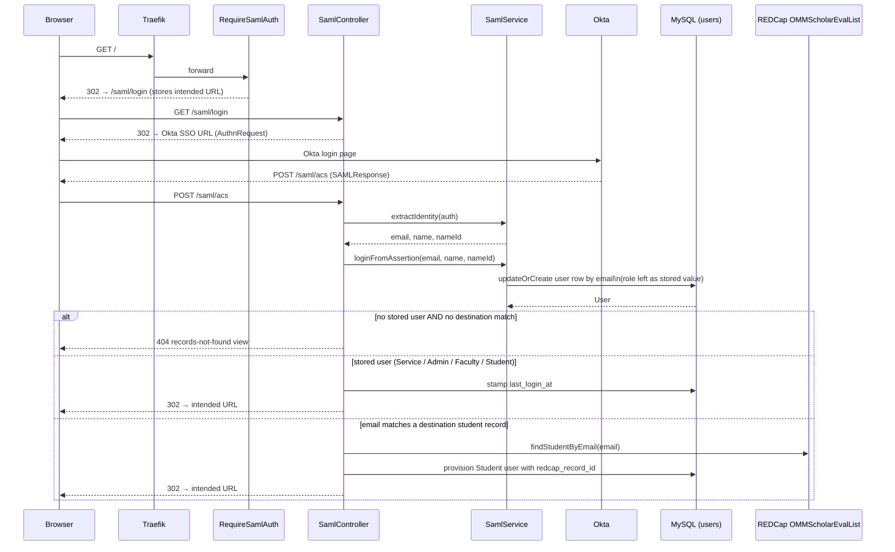
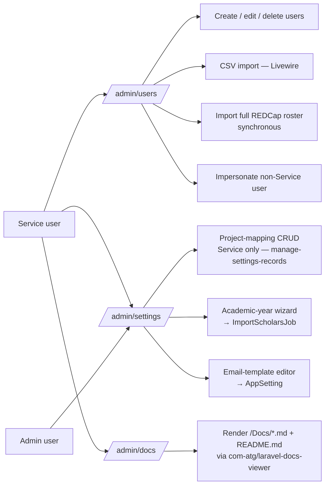

# Architecture

## System Context

The app sits between annual REDCap source projects, a permanent REDCap destination project, an Okta tenant, and a mail server. State is persisted in MySQL (users, project mappings, app settings, sessions, cache, queue) and in REDCap (student records, aggregates).



---

## Container Architecture



**Supervisor** manages two processes inside one container:

| Process | Command | Priority |
|---------|---------|----------|
| php-fpm | `php-fpm -F` | 5 (starts first) |
| nginx | `nginx -g "daemon off;"` | 10 |

Bulk processing is dispatched with `dispatchAfterResponse()` and stores progress in the cache. In development, `composer run dev` starts `queue:listen`; production should run a queue worker when `QUEUE_CONNECTION=database`.

---

## Component Breakdown



Other classes worth knowing about (not pictured above):

| Class | Role |
|-------|------|
| `App\Jobs\ImportScholarsJob` | Queued import of destination students for a project mapping; cache-backed progress (`import_scholars:{jobId}`) |
| `App\Jobs\ProcessSourceProjectJob` | Queued bulk re-aggregation of every record in a source project |
| `App\Models\AppSetting` | Key/value store with per-key `Cache::rememberForever`; currently used for the `email_template` override |
| `App\Services\MailTemplateRenderer` | Renders an `AppSetting('email_template')` Blade template against `EvaluationNotification::sampleViewData()` for the live admin preview |
| `App\Support\EvalAggregator` | Shared aggregation logic used by `NotifierController`, `ProcessSourceProjectJob`, and `omm:process-source` |
| `App\Support\SemesterSlot` | Maps `(semester code, date_lab, cohort_start_term, cohort_start_year)` to slot `1–4`; rejects evals outside the window |

---

## SAML Authentication Flow



Roles are persisted on `users.role`. Unlike earlier versions of this app, the app does **not** recompute roles from `SERVICE_USERS=` / `ADMIN_USERS=` env vars at every login. Those vars are consumed by `DatabaseSeeder` to bootstrap initial accounts; subsequent role changes happen via `/admin/users`.

---

## Webhook Request Flow

```mermaid
sequenceDiagram
    participant TR as Traefik
    participant MW as VerifyWebhookToken
    participant NC as NotifierController
    participant SRC as RedcapSourceService
    participant DST as RedcapDestinationService
    participant SS as SemesterSlot
    participant AGG as EvalAggregator
    participant MAIL as Mail

    TR->>MW: POST /omm_ace/notify?token=xxx
    MW->>MW: hash_equals(secret, token)
    alt token invalid
        MW-->>TR: 403 Forbidden
    end

    MW->>NC: __invoke(request)
    NC->>NC: validate record ID present
    NC->>NC: resolve active project mapping → token

    NC->>SRC: getRecord(recordId, token)
    SRC-->>NC: evalRecord[]

    NC->>NC: validate student / semester / eval_category / date_lab

    NC->>DST: findStudentByDatatelId(studentCode)
    Note over DST: filterLogic [datatelid]='...' + 1h cache;<br/>returns cohort_start_term, cohort_start_year, batch, is_active
    DST-->>NC: studentRecord[]

    NC->>SS: compute(semesterCode, date_lab, cohortTerm, cohortYear)
    SS-->>NC: slot 1–4 (or null → skip + 200)

    NC->>SRC: getStudentEvals(studentCode, semesterCode, evalYear, token)
    SRC-->>NC: allEvals[] (filtered to year of date_lab)

    NC->>AGG: aggregate(allEvals, slotKey)
    AGG-->>NC: { fields: { sem{n}_nu_*, sem{n}_avg_*, sem{n}_dates_*, sem{n}_comments }, by_category, slot_key }

    NC->>DST: updateStudentRecord(payload)
    DST-->>NC: "1"

    NC->>MAIL: EvaluationNotification(slotKey, slotLabel, slotIndex, ...)
    Note over MAIL: To: student<br/>CC: faculty<br/>BCC: admin

    NC-->>TR: 200 OK
```

---

## Slot 1–4 Aggregation Model

Each scholar has a 4-semester evaluation window starting at their cohort start term/year. An incoming source eval is mapped to slot `1`, `2`, `3`, or `4` based on:

```
ordinal(term, year) = year * 2 + (Fall ? 1 : 0)
slot = ordinal(eval) - ordinal(cohort) + 1
```

Slots outside `[1, 4]` (eval before cohort start, or after slot 4) are rejected and the webhook returns 200 without aggregating.

```mermaid
flowchart TD
    A[Fetch all evals\nfor student + semester + year] --> B{For each eval}
    B --> C{Score field\npresent & non-empty?}
    C -- No --> G
    C -- Yes --> D{0 ≤ score ≤ 100?}
    D -- No --> E[Log warning, skip]
    E --> G
    D -- Yes --> F[Add to sum, increment count\ncollect Faculty + date]
    F --> G{More evals?}
    G -- Yes --> B
    G -- No --> H[Compute avg = sum / count per category]
    H --> I[Build payload:\nsem{slot}_nu_{cat}, sem{slot}_avg_{cat},\nsem{slot}_dates_{cat}, sem{slot}_nu_comments,\nsem{slot}_comments]
    I --> J[importRecords to destination]
```

**Category → field mapping:**

| eval_category | Label | Source score field | Destination avg field |
|---|---|---|---|
| A | Teaching | `teaching_score` | `sem{slot}_avg_teaching` |
| B | Clinic | `clinical_performance_score` | `sem{slot}_avg_clinic` |
| C | Research | `research_total_score` | `sem{slot}_avg_research` |
| D | Didactics | `didactic_total_score` | `sem{slot}_avg_didactics` |

**Source semester code:** `'1'` → Spring, `'2'` → Fall (used together with the year of `date_lab` to pick the right slot).

---

## Persistence Design

The application keeps operational state in MySQL and aggregate evaluation data in REDCap:

| Concern | Solution |
|---------|---------|
| Sessions | `SESSION_DRIVER=database` — `sessions` table in MySQL |
| Cache | `CACHE_STORE=database` — `cache` table; destination roster cached 10 min, per-datatelid lookup 1 h, process & student-import status 60 min, `AppSetting` values cached forever per key |
| Queue | `QUEUE_CONNECTION=database` — `jobs` table; `ProcessSourceProjectJob` dispatched after response, `ImportScholarsJob` dispatched from the academic-year wizard |
| Migrations | `users` (with cohort fields + soft deletes + public_token), `project_mappings` (with `is_active`), `app_settings`, `sessions`, `cache`, `jobs`, `password_reset_tokens` |
| Persistence | User records (with roles + REDCap record IDs + cohort metadata), project mappings, and app settings (e.g. custom email template) in MySQL; aggregated grades in REDCap |

User authentication state is stored in the database-backed session. The `users` table caches each student's `redcap_record_id` and cohort metadata (`cohort_start_term`, `cohort_start_year`, `batch`, `is_active`) after the destination roster is imported, avoiding a REDCap API call on every request.

---

## Admin Surface

In addition to the webhook and student/faculty views, the app exposes an admin surface under `/admin`:



See [Admin Features](admin-features.md) for routes, gates, validation rules, and the CSV import workflow.

**Gates** (defined in `AppServiceProvider`):

| Gate | Allowed roles | Notes |
|------|---------------|-------|
| `view-dashboard` | Service, Admin, Faculty | Students redirect to `/student` |
| `view-student-page` | Service, Admin, Student (own record) | |
| `view-all-students` | Service, Admin | |
| `view-faculty-detail` | Service, Admin, Faculty | |
| `run-process` | Service | |
| `manage-users` | Service | |
| `manage-settings` | Service, Admin | View `/admin/settings`; Admin sees the email template + mapping list |
| `manage-settings-records` | Service | Sub-gate for project-mapping create / update / delete / activate / restore / import-students |
| `edit-email-template` | Service, Admin | Both can save and preview the `email_template` AppSetting |
| `view-docs` | Service | `/admin/docs` documentation viewer |
