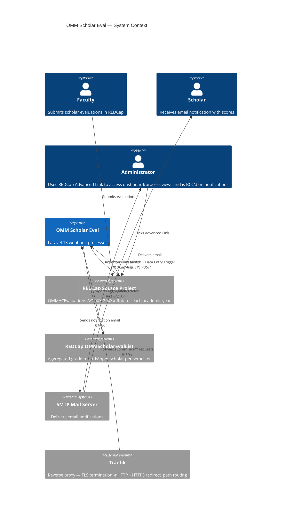
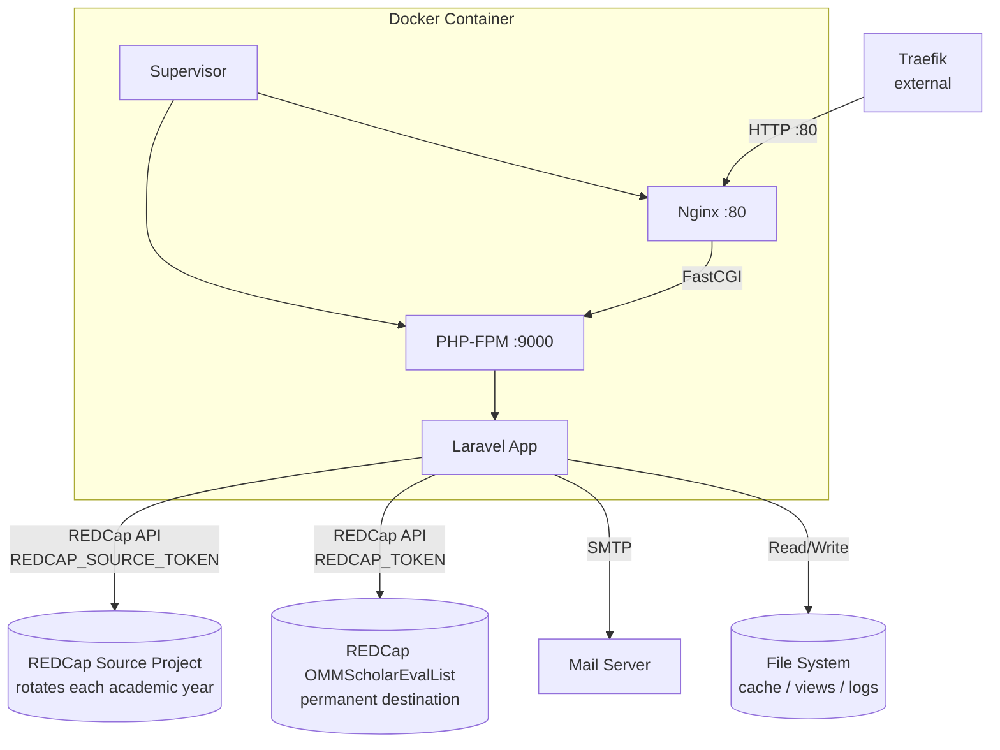
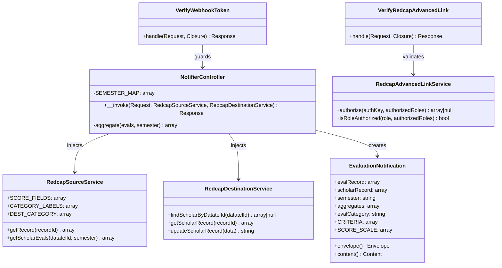
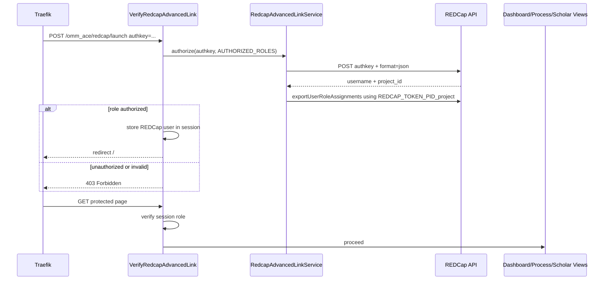
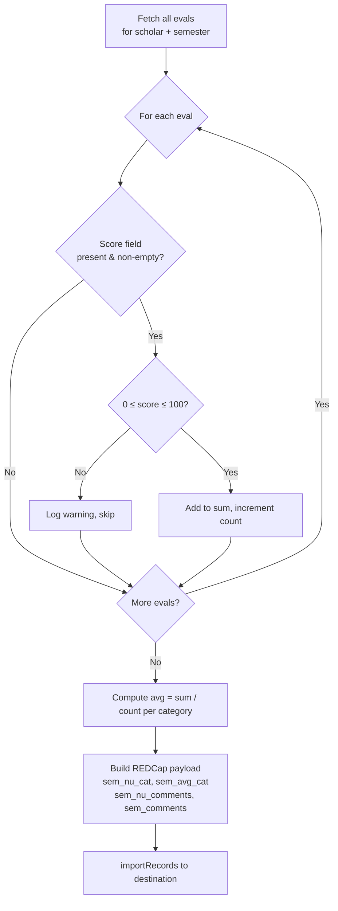

# Architecture

## System Context

The app sits between two REDCap projects and a mail server. It has no persistent database — all state lives in REDCap and the file system cache.

---

## Container Architecture

**Supervisor** manages two processes inside one container:

| Process | Command | Priority |
|---------|---------|----------|
| php-fpm | `php-fpm -F` | 5 (starts first) |
| nginx | `nginx -g "daemon off;"` | 10 |

No queue worker is needed — `QUEUE_CONNECTION=sync` processes jobs inline during the request.

---

## Component Breakdown

---

## Advanced Link Request Flow

---

## Webhook Request Flow

```mermaid
sequenceDiagram
    participant TR as Traefik
    participant MW as VerifyWebhookToken
    participant NC as NotifierController
    participant SRC as RedcapSourceService
    participant DST as RedcapDestinationService
    participant MAIL as Mail

    TR->>MW: POST /omm_ace/notify?token=xxx
    MW->>MW: hash_equals(secret, token)
    alt token invalid
        MW-->>TR: 403 Forbidden
    end

    MW->>NC: __invoke(request)
    NC->>NC: validate record ID present

    NC->>SRC: getRecord(recordId)
    SRC-->>NC: evalRecord[]

    NC->>NC: validate student, semester, eval_category

    NC->>SRC: getScholarEvals(scholarCode, semesterCode)
    SRC-->>NC: allEvals[]

    NC->>NC: aggregate(allEvals, semester)
    Note over NC: Sum scores per category<br/>Count evals, skip out-of-range<br/>Concatenate comments

    NC->>DST: findScholarByDatatelId(scholarCode)
    Note over DST: filterLogic [datatelid]='...' + 1h cache
    DST-->>NC: scholarRecord[]

    NC->>DST: updateScholarRecord(payload)
    DST-->>NC: "1"

    NC->>MAIL: EvaluationNotification
    Note over MAIL: To: scholar<br/>CC: faculty<br/>BCC: admin

    NC-->>TR: 200 OK
```

---

## Aggregation Logic

For each webhook trigger the app re-computes the full semester aggregate from scratch (not incremental), ensuring the destination is always consistent even if earlier records were corrected.

**Category → field mapping:**

| eval_category | Label | Score field | Destination avg field |
|---|---|---|---|
| A | Teaching | `teaching_score` | `{sem}_avg_teaching` |
| B | Clinic | `clinical_performance_score` | `{sem}_avg_clinic` |
| C | Research | `research_total_score` | `{sem}_avg_research` |
| D | Didactics | `didactic_total_score` | `{sem}_avg_didactics` |

**Semester mapping:** `'1'` → `spring`, `'2'` → `fall`

---

## Stateless Design

The application intentionally has no database. This simplifies operations significantly:

| Concern | Solution |
|---------|---------|
| Sessions | `SESSION_DRIVER=cookie` — no server-side state |
| Cache | `CACHE_STORE=file` — scholar lookup cached 1 h in `storage/framework/cache` |
| Queue | `QUEUE_CONNECTION=sync` — webhook processed inline |
| Migrations | None — no schema to manage |
| Persistence | All data lives in REDCap |

Advanced Link authorization data is stored in the encrypted Laravel cookie session. No REDCap user records are written to local storage.
