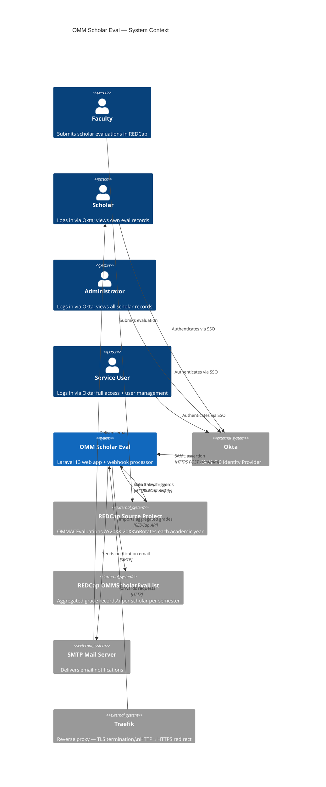
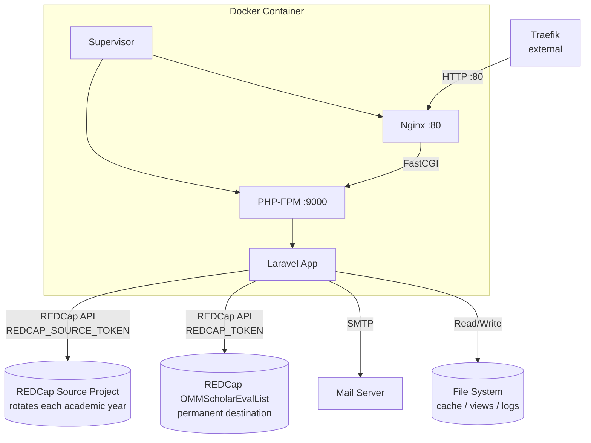
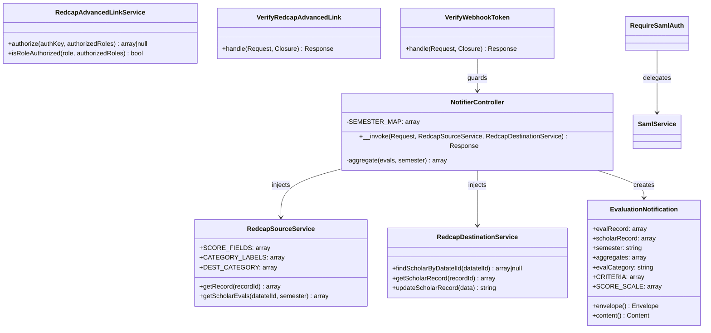
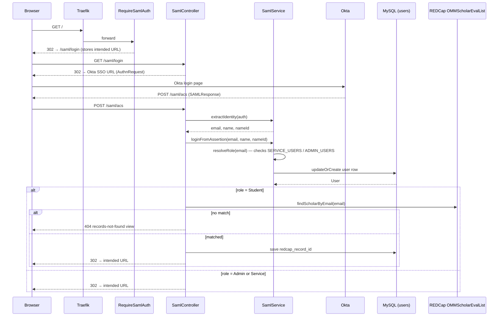
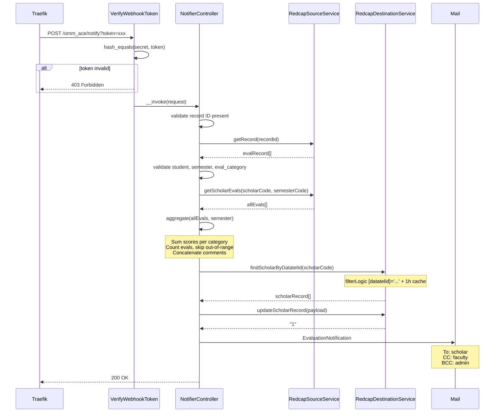
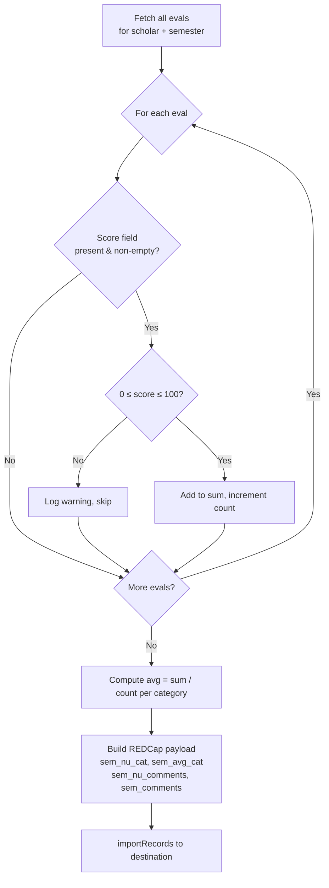

# Architecture

## System Context

The app sits between two REDCap projects, an Okta tenant, and a mail server. State is persisted in MySQL (users, sessions, cache, queue) and in REDCap (scholar records, aggregates).

---

## Container Architecture

**Supervisor** manages two processes inside one container:

| Process | Command | Priority |
|---------|---------|----------|
| php-fpm | `php-fpm -F` | 5 (starts first) |
| nginx | `nginx -g "daemon off;"` | 10 |

No queue worker is needed — `QUEUE_CONNECTION=sync` processes jobs inline during the request.

---

## Component Breakdown

---

## SAML Authentication Flow

---

## Webhook Request Flow

---

## Aggregation Logic

For each webhook trigger the app re-computes the full semester aggregate from scratch (not incremental), ensuring the destination is always consistent even if earlier records were corrected.

**Category → field mapping:**

| eval_category | Label | Score field | Destination avg field |
|---|---|---|---|
| A | Teaching | `teaching_score` | `{sem}_avg_teaching` |
| B | Clinic | `clinical_performance_score` | `{sem}_avg_clinic` |
| C | Research | `research_total_score` | `{sem}_avg_research` |
| D | Didactics | `didactic_total_score` | `{sem}_avg_didactics` |

**Semester mapping:** `'1'` → `spring`, `'2'` → `fall`

---

## Stateless Design

The application intentionally has no database. This simplifies operations significantly:

| Concern | Solution |
|---------|---------|
| Sessions | `SESSION_DRIVER=database` — `sessions` table in MySQL |
| Cache | `CACHE_STORE=database` — `cache` table; scholar roster cached 10 min, per-scholar 1 h |
| Queue | `QUEUE_CONNECTION=database` — `jobs` table; bulk-aggregation job dispatched after response |
| Migrations | `users`, `sessions`, `cache`, `jobs`, `password_reset_tokens` |
| Persistence | User records (with roles + REDCap record IDs) in MySQL; aggregated grades in REDCap |

User authentication state is stored in the database-backed session. The `users` table caches each scholar's `redcap_record_id` after their first SAML login, avoiding a REDCap API call on every request.
