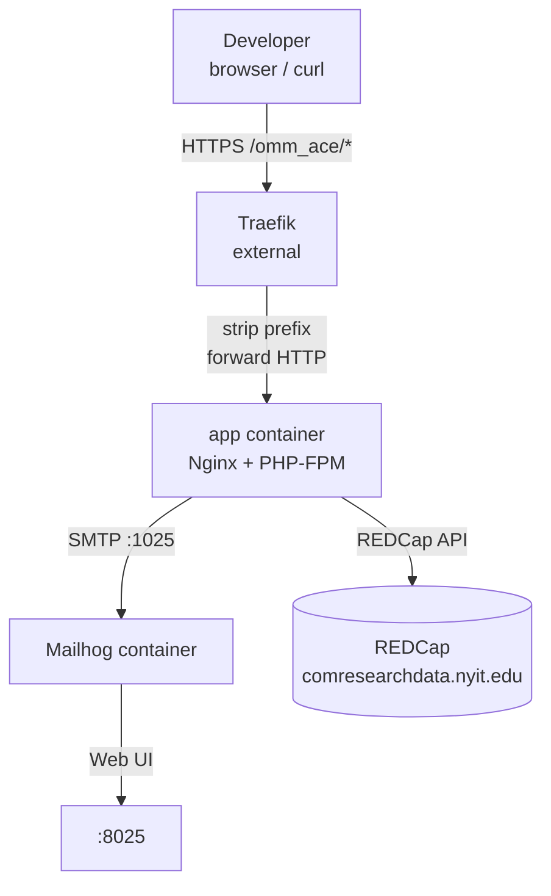

# Local Development

## Prerequisites

| Tool | Version | Purpose |
|------|---------|---------|
| PHP | 8.4 | Running Artisan commands and tests locally |
| Composer | 2.x | PHP dependency management |
| Docker + Compose | v2 | Full local stack |
| Node / npm | 22 | Asset compilation (via Docker, or locally) |

---

## Local Stack



The local compose file starts two services:

| Service | Image | Ports exposed |
|---------|-------|--------------|
| `app` | Built from `Dockerfile` (runtime stage) | None — routed via Traefik |
| `mailhog` | `mailhog/mailhog:latest` | `1025` (SMTP), `8025` (Web UI) |

Traefik is **not** in the compose file — it's expected to be running externally on the host.

---

## First-Time Setup

```bash
# 1. Install PHP dependencies
composer install

# 2. Copy environment file
cp .env.example .env

# 3. Generate application key
php artisan key:generate

# 4. Configure .env — required values:
#    REDCAP_URL, REDCAP_TOKEN, REDCAP_SOURCE_TOKEN
#    Mail settings (or leave as Mailhog defaults)

# 5. Start the stack
docker compose up -d --build

# 6. Verify the app is reachable
curl -s https://your-local-domain/omm_ace/up
```

---

## Environment Variables

All variables live in `.env` (copied from `.env.example`).

### Application

| Variable | Default | Description |
|----------|---------|-------------|
| `APP_NAME` | `OMM Scholar Eval` | Application name |
| `APP_ENV` | `local` | Environment name |
| `APP_KEY` | _(generated)_ | Laravel encryption key |
| `APP_DEBUG` | `true` | Enable debug output |
| `APP_URL` | `http://localhost` | Base URL |

### Session / Cache / Queue

| Variable | Value | Notes |
|----------|-------|-------|
| `SESSION_DRIVER` | `cookie` | No server-side session storage |
| `CACHE_STORE` | `file` | Scholar lookup cached in `storage/framework/cache` |
| `QUEUE_CONNECTION` | `sync` | Jobs processed inline — no worker needed |

### REDCap

| Variable | Description |
|----------|-------------|
| `REDCAP_URL` | REDCap API base URL (`https://comresearchdata.nyit.edu/redcap/api/`) |
| `REDCAP_TOKEN` | Destination project token (OMMScholarEvalList) |
| `REDCAP_SOURCE_TOKEN` | Source project token — update each academic year when a new evaluation project is created |
| `WEBHOOK_SECRET` | Shared secret for webhook token verification. Leave empty locally to skip the check. |

### Mail (Mailhog defaults)

| Variable | Default |
|----------|---------|
| `MAIL_MAILER` | `smtp` |
| `MAIL_HOST` | `mailhog` (Docker service name) |
| `MAIL_PORT` | `1025` |
| `MAIL_FROM_ADDRESS` | `noreply@omm-se.local` |

---

## Simulating a Webhook

With the stack running, simulate a REDCap Data Entry Trigger:

```bash
# Without token auth (WEBHOOK_SECRET empty locally)
curl -X POST https://your-local-domain/omm_ace/notify \
  -d "record=1&project_id=<current-year-pid>&instrument=omm_ace_evaluations"

# With token auth
curl -X POST "https://your-local-domain/omm_ace/notify?token=your-secret" \
  -d "record=1&project_id=<current-year-pid>&instrument=omm_ace_evaluations"
```

Check the result:
- Response should be `200` with an empty body
- Check logs: `docker compose logs app`
- View sent email: open `http://localhost:8025` (Mailhog Web UI)

---

## Email Preview

A development-only route renders the email template without hitting REDCap:

```
GET https://your-local-domain/omm_ace/test/email
```

This renders a stubbed Teaching (Category A) evaluation for Catherine Chin. Refresh after editing [`resources/views/emails/evaluation.blade.php`](../resources/views/emails/evaluation.blade.php) to preview changes.

---

## Useful Commands

```bash
# Run all tests
php artisan test --compact

# Run a specific test
php artisan test --compact --filter="aggregates scores"

# Clear file cache (e.g. after changing scholar lookup)
php artisan cache:clear

# Tail application logs
docker compose logs -f app

# Rebuild the Docker image after code changes
docker compose up -d --build app

# Open an interactive shell inside the container
docker compose exec app sh
```

---

## Hot Reload (Source Code)

The local compose file mounts the entire project into the container:

```yaml
volumes:
  - .:/var/www/html          # source code
  - /var/www/html/vendor     # keep container's vendor intact
  - /var/www/html/node_modules
  - /var/www/html/public/build
```

PHP file changes are reflected immediately — no rebuild needed. If you change `package.json` or Blade files that affect compiled assets, run:

```bash
npm run build   # or: npm run dev (watch mode)
```
