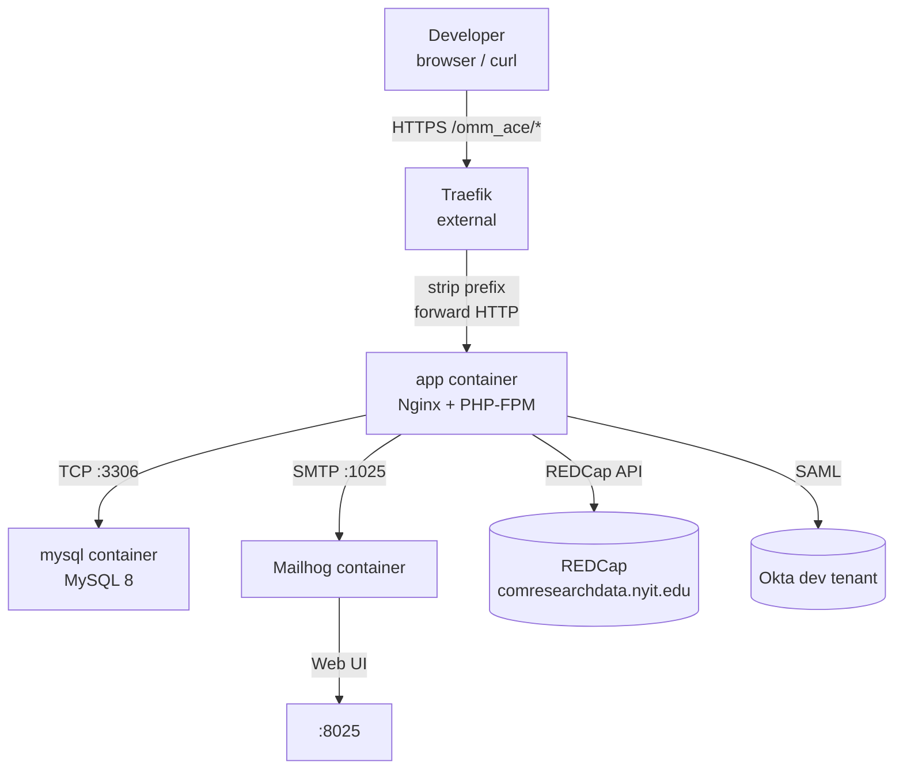

# Local Development

## Prerequisites

| Tool | Version | Purpose |
|------|---------|---------|
| PHP | 8.4+ | Running Artisan commands and tests locally |
| Composer | 2.x | PHP dependency management |
| Docker + Compose | v2 | Full local stack |
| Node / npm | 22 | Asset compilation (via Docker, or locally) |

---

## Local Stack



The local compose file starts three services:

| Service | Image | Ports exposed |
|---------|-------|--------------|
| `app` | Built from `Dockerfile` (runtime stage) | None — routed via Traefik to container port 8080 |
| `mysql` | `mysql:8.0` | `3306`; data in named volume `mysql-data` |
| `mailhog` | `mailhog/mailhog:latest` | `1025` (SMTP), `8025` (Web UI) |

Traefik is **not** in the compose file — it's expected to be running externally on the host.

---

## First-Time Setup

```bash
# 1. Install PHP dependencies
composer install

# 2. Copy environment file
cp .env.example .env

# 3. Generate application key
php artisan key:generate

# 4. Configure .env — required values:
#    REDCAP_URL, REDCAP_TOKEN
#    DB_* (defaults in .env.example work with the mysql compose service)
#    SAML_IDP_* values if testing the real SAML flow (see "Simulating SSO")
#    SERVICE_USERS / ADMIN_USERS for bootstrap role enrollment
#    Mail settings (or leave as Mailhog defaults)

# 5. Start the stack (brings up app + mysql + mailhog)
docker compose up -d --build

# 6. Run migrations (entrypoint already does this in the container, but handy locally)
docker compose exec app php artisan migrate --seed

# 7. Verify the app is reachable
curl -s https://your-local-domain/omm_ace/up
```

The seeder creates a default Service-role user: `Mihir.Matalia@nyit.edu`. You can add your own by editing `database/seeders/DatabaseSeeder.php` or by putting your email in `SERVICE_USERS=` and signing in via SAML.

---

## Environment Variables

All variables live in `.env` (copied from `.env.example`).

### Application

| Variable | Default | Description |
|----------|---------|-------------|
| `APP_NAME` | `OMM Scholar Eval` | Application name |
| `APP_ENV` | `local` | Environment name |
| `APP_KEY` | _(generated)_ | Laravel encryption key |
| `APP_DEBUG` | `true` | Enable debug output |
| `APP_URL` | `http://localhost` | Base URL |

### Database / Session / Cache / Queue

| Variable | Value | Notes |
|----------|-------|-------|
| `DB_CONNECTION` | `mysql` | MySQL 8 via the `mysql` docker-compose service |
| `DB_HOST` | `mysql` | Docker service name |
| `DB_DATABASE` / `DB_USERNAME` / `DB_PASSWORD` | `omm_se` / `omm_se` / `secret` | Defaults match the compose service |
| `SESSION_DRIVER` | `database` | Sessions table populated by migrations |
| `CACHE_STORE` | `database` | Student lookup and dashboard caches in `cache` table |
| `QUEUE_CONNECTION` | `database` | Jobs table; `composer run dev` starts `queue:listen` |

### REDCap

| Variable | Description |
|----------|-------------|
| `REDCAP_URL` | REDCap API base URL (`https://comresearchdata.nyit.edu/redcap/api/`) |
| `REDCAP_TOKEN` | Destination project token (OMMScholarEvalList) |
| `WEBHOOK_SECRET` | Shared secret for webhook token verification. Leave empty locally to skip the check. |
| Source project tokens | Stored in `/admin/settings` project mappings, encrypted in the `project_mappings` table. |

### Okta SAML SSO

| Variable | Description |
|----------|-------------|
| `SAML_IDP_ENTITY_ID` / `SAML_IDP_SSO_URL` / `SAML_IDP_SLO_URL` / `SAML_IDP_X509_CERT` | From the Okta app's SAML setup instructions |
| `SAML_SP_ENTITY_ID` / `SAML_SP_ACS_URL` / `SAML_SP_SLO_URL` | Defaults derive from `APP_URL` |
| `SAML_ATTR_EMAIL` / `SAML_ATTR_NAME` | Attribute names the Okta app sends in assertions |
| `SAML_STRICT` | `true` in all environments that talk to a real IdP |
| `SAML_DEBUG` | `true` to log assertion contents during local debugging |
| `SERVICE_USERS` / `ADMIN_USERS` | Comma-separated emails. Your email goes here for full access. |

### Mail (Mailhog defaults)

| Variable | Default |
|----------|---------|
| `MAIL_MAILER` | `smtp` |
| `MAIL_HOST` | `mailhog` (Docker service name) |
| `MAIL_PORT` | `1025` |
| `MAIL_FROM_ADDRESS` | `noreply@omm-se.local` |

---

## Simulating a Webhook

With the stack running and a matching project mapping in `/admin/settings`, simulate a REDCap Data Entry Trigger:

```bash
# Without token auth (WEBHOOK_SECRET empty locally)
curl -X POST https://your-local-domain/omm_ace/notify \
  -d "record=1&project_id=<current-year-pid>&instrument=omm_ace_evaluations"

# With token auth
curl -X POST "https://your-local-domain/omm_ace/notify?token=your-secret" \
  -d "record=1&project_id=<current-year-pid>&instrument=omm_ace_evaluations"
```

Check the result:
- Response should be `200` with an empty body
- Check logs: `docker compose logs app`
- View sent email: open `http://localhost:8025` (Mailhog Web UI)

---

## Simulating SSO Login Locally

The app uses Okta SAML. For day-to-day local development you don't need a real SAML round-trip — bypass it using Tinker:

```bash
php artisan tinker --execute 'use App\Models\User; Auth::login(User::where("email","mihir.matalia@nyit.edu")->firstOrFail());'
```

Or use the development-only local login page:

```
GET /local/login
```

You can also create a one-off Service user in Tinker:

```bash
php artisan tinker --execute '
use App\Models\User; use App\Enums\Role;
User::factory()->service()->create(["email" => "me@example.com", "name" => "Me"]);
'
```

Then open `http://localhost` — the session is already authenticated.

### Testing the Real SAML Flow

To test end-to-end Okta login locally, set `APP_URL=http://localhost` and configure an [Okta developer account](https://developer.okta.com) with a new SAML 2.0 app:

| Setting | Value |
|---------|-------|
| Single Sign-On URL (ACS) | `http://localhost/saml/acs` |
| Audience URI (SP Entity ID) | `http://localhost/saml/metadata` |
| Single Logout URL | `http://localhost/saml/logout` |
| Attribute statement: `email` | `user.email` |
| Attribute statement: `displayName` | `user.displayName` |

Copy the IdP Entity ID, SSO URL, SLO URL, and certificate into the `SAML_IDP_*` vars in `.env`, then set `SAML_STRICT=false` (Okta's timing window can mismatch with local clocks).

### Role Management

Service/Admin roles are resolved at login time from `.env` allowlists. Add your email to test elevated roles without touching the database:

```bash
SERVICE_USERS=you@example.com
ADMIN_USERS=colleague@example.com
```

Restart the dev server after changing `.env` so the new config is picked up.

---

## Email Preview

A development-only route renders the email template without hitting REDCap:

```
GET https://your-local-domain/omm_ace/test/email
```

This renders a stubbed Teaching (Category A) evaluation for Catherine Chin. Refresh after editing [`resources/views/emails/evaluation.blade.php`](../resources/views/emails/evaluation.blade.php) to preview changes.

---

## Useful Commands

```bash
# Run all tests
php artisan test --compact

# Run a specific test
php artisan test --compact --filter="aggregates scores"

# Clear cache (e.g. after changing student lookup data)
php artisan cache:clear

# Tail application logs
docker compose logs -f app

# Rebuild the Docker image after code changes
docker compose up -d --build app

# Open an interactive shell inside the container
docker compose exec app sh
```

---

## Hot Reload (Source Code)

The local compose file mounts the entire project into the container:

```yaml
volumes:
  - .:/var/www/html          # source code
  - /var/www/html/vendor     # keep container's vendor intact
  - /var/www/html/node_modules
  - /var/www/html/public/build
```

PHP file changes are reflected immediately — no rebuild needed. If you change `package.json` or Blade files that affect compiled assets, run:

```bash
npm run build   # or: npm run dev (watch mode)
```
