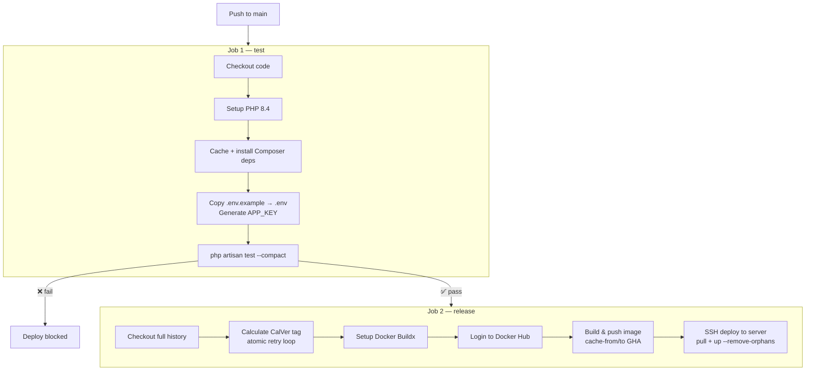
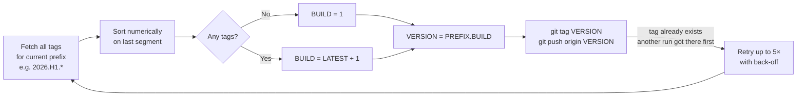
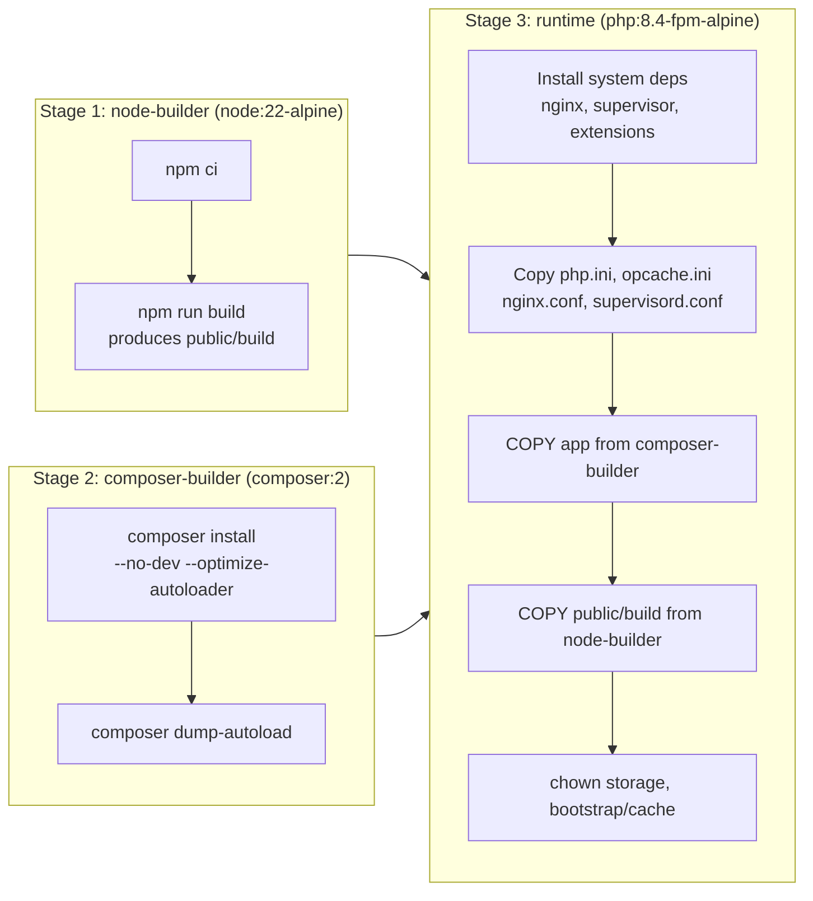
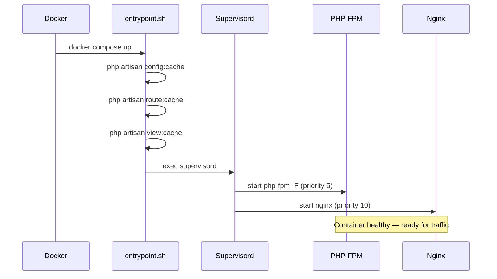
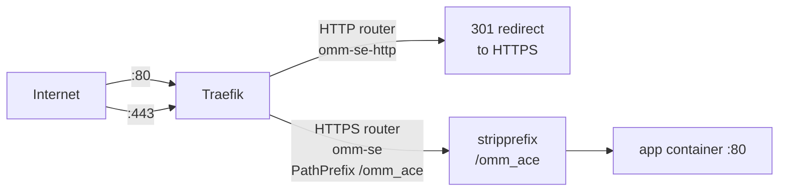

# Production Deployment

## CI/CD Pipeline

Every push to `main` triggers a two-job GitHub Actions workflow.



### Required GitHub Secrets

| Secret | Description |
|--------|-------------|
| `DOCKERHUB_USERNAME` | Docker Hub account username |
| `DOCKERHUB_TOKEN` | Docker Hub access token (not your password) |
| `SSH_HOST` | Production server IP or hostname |
| `SSH_USER` | SSH user on the production server |
| `SSH_KEY` | Private SSH key (the server must have the public key in `authorized_keys`) |

---

## CalVer Versioning

Tags follow `YYYY.HX.N` where:
- `YYYY` — four-digit year
- `HX` — half-year (`H1` = Jan–Jun, `H2` = Jul–Dec)
- `N` — build number, incrementing from 1, **resets each half-year**

```
2026.H1.1   ← first build of H1 2026
2026.H1.2   ← second build
2026.H2.1   ← first build after July 1 (resets)
2027.H1.1   ← first build of 2027
```



The tag is pushed **before** the Docker image is built, making it the authoritative version identifier.

---

## Docker Image

### Multi-Stage Build



**PHP extensions included:** `mbstring`, `zip`, `gd`, `opcache`, `pcntl`, `bcmath`, `intl`

**OPcache tuning** (`docker/php/opcache.ini`):
- `validate_timestamps=0` — no filesystem stat on every request
- `revalidate_freq=0` — immutable cached bytecode
- `memory_consumption=128` MB
- `max_accelerated_files=10000`

### Image Tags

Each release pushes two tags to Docker Hub:

| Tag | Meaning |
|-----|---------|
| `{DOCKERHUB_USERNAME}/omm-se:2026.H1.3` | Specific build — immutable |
| `{DOCKERHUB_USERNAME}/omm-se:latest` | Always points to the most recent release |

---

## Server Setup

### Prerequisites

The production server needs:
- Docker Engine + Compose v2
- Traefik running and listening on ports `80` and `443` with `web` and `websecure` entrypoints
- SSH access configured for the deploy user

### Initial Setup

```bash
# On the production server
mkdir -p /opt/omm-se
cd /opt/omm-se

# Copy docker-compose.prod.yml
scp docker-compose.prod.yml user@server:/opt/omm-se/

# Create production .env from the example
cp .env.example .env
# Edit .env — set all required values (see below)
nano .env

# Pull and start for the first time
export DOCKERHUB_USERNAME=your-username
export APP_VERSION=latest
docker compose -f docker-compose.prod.yml pull
docker compose -f docker-compose.prod.yml up -d
```

### Production `.env` Checklist

```bash
APP_ENV=production
APP_DEBUG=false
APP_KEY=                    # php artisan key:generate --show
APP_URL=https://your-domain.com

SESSION_DRIVER=cookie
CACHE_STORE=file
QUEUE_CONNECTION=sync

MAIL_MAILER=smtp
MAIL_HOST=your-smtp-host
MAIL_PORT=587
MAIL_USERNAME=your-smtp-user
MAIL_PASSWORD=your-smtp-password
MAIL_FROM_ADDRESS=noreply@your-domain.com
MAIL_FROM_NAME="OMM Scholar Eval"

REDCAP_URL=https://comresearchdata.nyit.edu/redcap/api/
REDCAP_TOKEN=               # Destination project token
REDCAP_SOURCE_TOKEN=        # Source project token — update each academic year
WEBHOOK_SECRET=             # openssl rand -hex 32

DOCKERHUB_USERNAME=your-dockerhub-username
```

---

## Container Startup Sequence



---

## Traefik Routing (Production)

The app registers itself with the external Traefik instance via Docker labels:



- Path prefix `/omm_ace` is stripped before the request reaches Laravel, so routes are defined as `/notify`, `/test/email`, etc.
- TLS is terminated by Traefik using whatever certificate resolver it is already configured with.

---

## Rolling Deployment

The deploy step performs a zero-downtime update of the app container only:

```bash
# Pull the newly built image
docker compose -f docker-compose.prod.yml pull app

# Recreate the app container; Traefik reconnects automatically
docker compose -f docker-compose.prod.yml up -d --remove-orphans app
```

There is no database to migrate, making rollouts instantaneous. To roll back, set `APP_VERSION` to a previous CalVer tag and re-run the same commands.

```bash
export APP_VERSION=2026.H1.2
docker compose -f docker-compose.prod.yml pull app
docker compose -f docker-compose.prod.yml up -d --remove-orphans app
```
