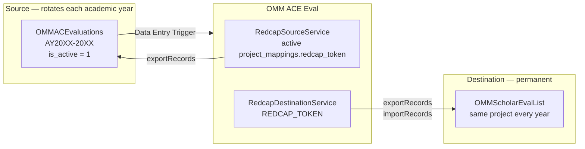
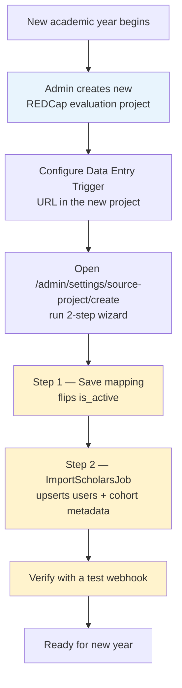
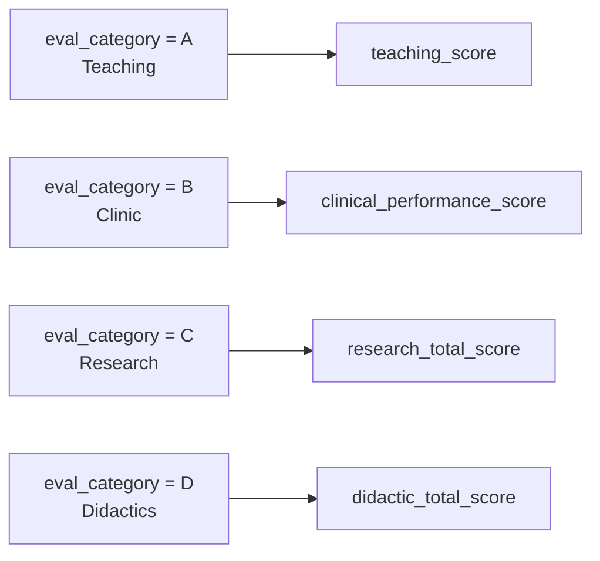
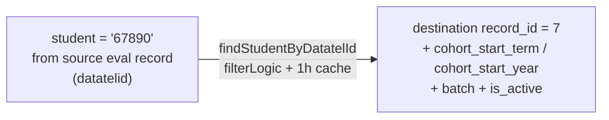

# REDCap Integration

## Project Overview

The **source project changes every academic year** — a new REDCap project is created for each cohort with a new PID and API token. The **destination project is permanent** and accumulates aggregate scores across all years. Exactly one source project mapping is marked `is_active` at any given time.



| | Source | Destination |
|---|---|---|
| Project name | OMMACEvaluations AY20XX-20XX | OMMScholarEvalList |
| PID | **Changes each academic year** | Fixed (permanent) |
| Token source | `project_mappings.redcap_token` (encrypted in MySQL) | `REDCAP_TOKEN` |
| Service class | `RedcapSourceService` | `RedcapDestinationService` |
| App role | Read only | Read + Write |
| Lifecycle | New project per academic year, marked `is_active` | Never recreated |

> **Annual rotation:** At the start of each academic year, a new source project is created in REDCap. Add a project mapping in `/admin/settings/source-project/create` with the REDCap PID and source API token. Saving the mapping flips the previous active mapping to `is_active = 0` and the new one to `is_active = 1` in a single transaction. The destination project and its token never change.

> **Note on user identity:** App authentication is via Okta SAML SSO (see [Security](security.md)). REDCap identity/role lookups are **not** part of the sign-in flow. Student users are mapped to their student record via `RedcapDestinationService::findStudentByEmail()` at login time; the matched `record_id` is cached on the `users` row alongside `cohort_start_term`, `cohort_start_year`, `batch`, and `is_active`.

---

## Annual Rotation Procedure



**What changes year-to-year:**
- Project mapping row — source REDCap PID, encrypted source API token, `is_active` flag
- REDCap DET URL in the new source project — same URL, same `WEBHOOK_SECRET`

**What never changes:**
- `REDCAP_TOKEN` — destination project token
- `WEBHOOK_SECRET` — can be reused or rotated independently
- All application code
- The destination REDCap project and its schema

---

## Source Schema

The source project field structure is expected to remain consistent year-to-year. Fields consumed by the app:

| Field | Type | Notes |
|-------|------|-------|
| `record_id` | Auto-ID | Used to fetch the triggering record |
| `student` | Text / Numeric | Student's datatelid — used to look up the destination record |
| `semester` | Dropdown | 1=Spring, 2=Fall (combined with `date_lab` year to compute slot) |
| `eval_category` | Dropdown | A=Teaching, B=Clinic, C=Research, D=Didactics |
| `date_lab` | Text/Date | Faculty enters when the eval occurred; the year of this date selects which slot the eval belongs to |
| `teaching_score` | Calc (0–100%) | Used when `eval_category = A` |
| `clinical_performance_score` | Calc (0–100%) | Used when `eval_category = B` |
| `research_total_score` | Calc (0–100%) | Used when `eval_category = C` |
| `didactic_total_score` | Calc (0–100%) | Used when `eval_category = D` |
| `comments` | Notes | Faculty free-text; appended to the slot comments column |
| `faculty` | Text | Faculty name — appears in date / comment attribution |
| `faculty_email` | Text | CC'd on notification email |

### Eval Category → Score Field Mapping



---

## Destination Schema — OMMScholarEvalList

The destination project is **permanent** — it stores aggregated scores for all students across all academic years. The app writes the following fields per student record. Each scholar has four evaluation slots (`sem1` … `sem4`) covering their 4-semester window. Fields not listed (e.g. `sem{n}_leadership`, `sem{n}_final_score`) are never touched.

**Pattern:** `{slot}` ∈ `{sem1, sem2, sem3, sem4}`, `{cat}` ∈ `{teaching, clinic, research, didactics}`

| Field pattern | Type | Written by app |
|---|---|---|
| `{slot}_nu_{cat}` | Integer | Yes — count of valid evals for that category in this slot |
| `{slot}_avg_{cat}` | Number (0–100) | Yes — average score; omitted if count = 0 |
| `{slot}_dates_{cat}` | Notes/Text | Yes — `Faculty Name, M/D/YYYY` entries joined with `; ` |
| `{slot}_nu_comments` | Integer | Yes — count of evals that have a comment |
| `{slot}_comments` | Notes | Yes — comments stored one per line as `Faculty; Date; Category; Comment` |
| `{slot}_leadership` | Text | **No** — set manually in REDCap |
| `{slot}_final_score` | Calc | **No** — calculated by REDCap formula |
| `datatelid` | Text | No — used for student lookup by datatelid |
| `cohort_start_term`, `cohort_start_year` | Text / Number | No — used to compute slot index for incoming evals |
| `batch`, `is_active` | Text / Yes-No | No — surfaced in the dashboard cohort filter |
| `first_name` / `last_name` | Text | No — used to build student display name |
| `goes_by` | Text | No — used for email greeting |
| `email` | Email | No — used as notification `To:` address |

### Example payload pushed to destination

```json
{
  "record_id": "3",
  "sem1_nu_teaching": 2,
  "sem1_avg_teaching": 87.5,
  "sem1_nu_clinic": 1,
  "sem1_avg_clinic": 91.0,
  "sem1_nu_research": 0,
  "sem1_nu_didactics": 0,
  "sem1_nu_comments": 1,
  "sem1_dates_teaching": "Dr. Smith, 4/16/2026",
  "sem1_comments": "Dr. Smith; 4/16/2026; Teaching; Excellent small group facilitation."
}
```

Note: `sem1_avg_research` and `sem1_avg_didactics` are **not included** when their count is 0 — this prevents overwriting a previously calculated average.

---

## Slot Computation

Each scholar has four slots covering two academic years. The app computes which slot an incoming eval belongs to from the source semester code, the year extracted from `date_lab`, and the scholar's `cohort_start_term` / `cohort_start_year` on the destination record.

```
ordinal(term, year) = year * 2 + (Fall ? 1 : 0)
slot                = ordinal(eval) - ordinal(cohort) + 1
```

Slot must be in `[1, 4]`. Out-of-window evals (before cohort start, or after slot 4) are logged and skipped — the webhook returns 200 without aggregating. The mapping is implemented in `App\Support\SemesterSlot::compute()`.

---

## Configuring the REDCap Data Entry Trigger

In REDCap → Project Setup → **Additional Customizations** → **Data Entry Trigger**. This must be configured in **every new source project** created for a new academic year:

```
https://your-server.example.com/omm_ace/notify?token=<WEBHOOK_SECRET>
```

- REDCap sends a `POST` with fields including `record`, `project_id`, `instrument`, `redcap_event_name`, etc.
- The app reads only the `record` field (the record ID); the source token is resolved from the active project mapping, not from `project_id`.
- The `token` query parameter is validated server-side using `hash_equals()` — see [Security](security.md).

### REDCap POST payload (example)

```
record=42
project_id=<current year PID>
instrument=omm_ace_evaluations
redcap_event_name=event_1_arm_1
redcap_data_access_group=
redcap_url=https://comresearchdata.nyit.edu/redcap/
```

---

## Student Lookup Strategy

The source project stores the student identifier in the `student` field as a **datatelid** (numeric institution ID). On each webhook, the app passes this value to `RedcapDestinationService::findStudentByDatatelId()`, which queries the destination project using REDCap's `filterLogic` parameter and caches the result for 1 hour. The query returns the cohort fields (`cohort_start_term`, `cohort_start_year`, `batch`, `is_active`) needed for slot computation.



The lookup queries `[datatelid]='67890'` against the destination project. Results are cached per datatelid for 1 hour since the student roster changes infrequently. No code-to-name mapping is needed.

---

## Year Filter on Source Eval Fetch

`RedcapSourceService::getStudentEvals(datatelId, semester, year, token)` requires a four-digit year so the recomputation only mixes evals from the same calendar year. The webhook extracts that year from the triggering record's `date_lab` (`SemesterSlot::yearFromDate`) and passes it through. REDCap can't filter on `date_lab` server-side (it's a free-text field), so the year filter is applied in PHP after the export. Datatelid and semester arguments are validated against strict allowlists (`/^\d+$/` and `/^[12]$/`) before any API call.

---

## Email Notification

Each webhook triggers one email:

| Header | Value |
|--------|-------|
| To | Student's `email` field from destination record |
| CC | `faculty_email` from source eval record |
| BCC | `MAIL_FROM_ADDRESS` (admin) |
| Subject | `[OMM Scholar Eval] {Category} Evaluation` |

The email body includes:
- Individual criterion scores for the submitted eval (criteria vary by `eval_category`)
- Overall calculated score for the category
- Faculty free-text feedback (if present)
- Slot summary table showing nu / avg for all 4 categories in the relevant slot

Email is **not sent** if the student's email address is missing or fails `FILTER_VALIDATE_EMAIL`. Faculty CC is silently omitted if their address is malformed. The body uses the saved `email_template` AppSetting if one exists, otherwise the packaged Blade view.
