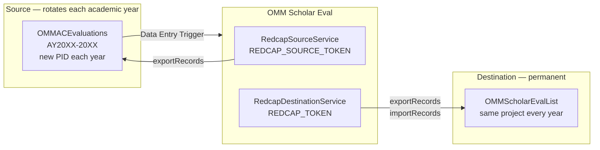
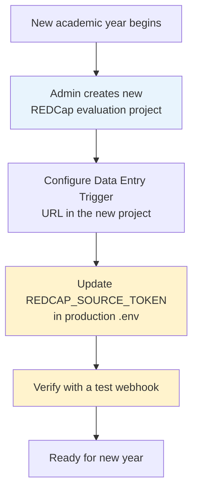
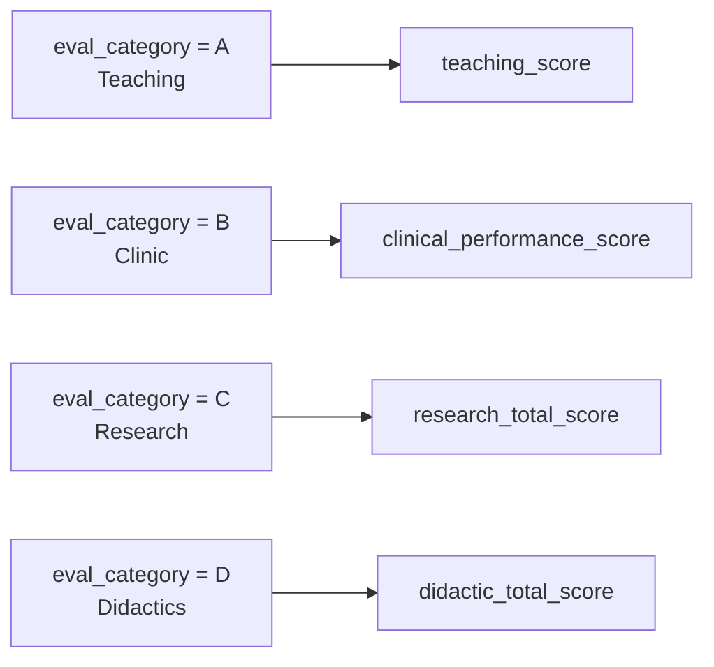
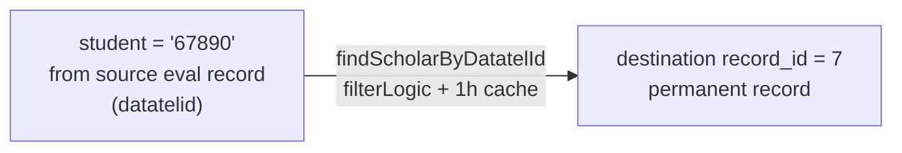

# REDCap Integration

## Project Overview

The **source project changes every academic year** — a new REDCap project is created for each cohort with a new PID and API token. The **destination project is permanent** and accumulates aggregate scores across all years.



| | Source | Destination |
|---|---|---|
| Project name | OMMACEvaluations AY20XX-20XX | OMMScholarEvalList |
| PID | **Changes each academic year** | Fixed (permanent) |
| Env token | `REDCAP_SOURCE_TOKEN` | `REDCAP_TOKEN` |
| Service class | `RedcapSourceService` | `RedcapDestinationService` |
| App role | Read only | Read + Write |
| Lifecycle | New project per academic year | Never recreated |

> **Annual rotation:** At the start of each academic year, a new source project is created in REDCap. Update only `REDCAP_SOURCE_TOKEN` in `.env` — no code changes required. The destination project and its token never change.

---

## Annual Rotation Procedure



**What changes year-to-year:**
- `REDCAP_SOURCE_TOKEN` in `.env` — new API token for the new source project
- REDCap DET URL in the new source project — same URL, same `WEBHOOK_SECRET`

**What never changes:**
- `REDCAP_TOKEN` — destination project token
- `WEBHOOK_SECRET` — can be reused or rotated independently
- All application code
- The destination REDCap project and its schema

---

## Source Schema

The source project field structure is expected to remain consistent year-to-year. Fields consumed by the app:

| Field | Type | Notes |
|-------|------|-------|
| `record_id` | Auto-ID | Used to fetch the triggering record |
| `student` | Text / Numeric | Scholar's datatelid — used to look up the destination record |
| `semester` | Dropdown | 1=Spring, 2=Fall |
| `eval_category` | Dropdown | A=Teaching, B=Clinic, C=Research, D=Didactics |
| `teaching_score` | Calc (0–100%) | Used when `eval_category = A` |
| `clinical_performance_score` | Calc (0–100%) | Used when `eval_category = B` |
| `research_total_score` | Calc (0–100%) | Used when `eval_category = C` |
| `didactic_total_score` | Calc (0–100%) | Used when `eval_category = D` |
| `comments` | Notes | Faculty free-text; appended as `[Faculty]: comment` |
| `faculty` | Text | Faculty name — appears in comment attribution |
| `faculty_email` | Text | CC'd on notification email |

### Eval Category → Score Field Mapping



---

## Destination Schema — OMMScholarEvalList

The destination project is **permanent** — it stores aggregated scores for all scholars across all academic years. The app writes the following fields per scholar record. Fields not listed (e.g. `{sem}_leadership`, `{sem}_final_score`) are never touched.

**Pattern:** `{sem}` ∈ `{spring, fall}`, `{cat}` ∈ `{teaching, clinic, research, didactics}`

| Field pattern | Type | Written by app |
|---|---|---|
| `{sem}_nu_{cat}` | Integer | Yes — count of valid evals for that category |
| `{sem}_avg_{cat}` | Number (0–100) | Yes — average score; omitted if count = 0 |
| `{sem}_nu_comments` | Integer | Yes — count of evals that have a comment |
| `{sem}_comments` | Notes | Yes — all comments concatenated with `\n\n` |
| `{sem}_leadership` | Text | **No** — set manually in REDCap |
| `{sem}_final_score` | Calc | **No** — calculated by REDCap formula |
| `datatelid` | Text | No — used for scholar lookup by datatelid |
| `first_name` | Text | No — used to build scholar display name |
| `last_name` | Text | No — used to build scholar display name |
| `goes_by` | Text | No — used for email greeting |
| `email` | Email | No — used as notification `To:` address |

### Example payload pushed to destination

```json
{
  "record_id": "3",
  "spring_nu_teaching": 2,
  "spring_avg_teaching": 87.5,
  "spring_nu_clinic": 1,
  "spring_avg_clinic": 91.0,
  "spring_nu_research": 0,
  "spring_nu_didactics": 0,
  "spring_nu_comments": 1,
  "spring_comments": "[Dr. Smith]: Excellent small group facilitation."
}
```

Note: `spring_avg_research` and `spring_avg_didactics` are **not included** when their count is 0 — this prevents overwriting a previously calculated average.

---

## Configuring the REDCap Data Entry Trigger

In REDCap → Project Setup → **Additional Customizations** → **Data Entry Trigger**. This must be configured in **every new source project** created for a new academic year:

```
https://your-server.example.com/omm_ace/notify?token=<WEBHOOK_SECRET>
```

- REDCap sends a `POST` with fields including `record`, `project_id`, `instrument`, `redcap_event_name`, etc.
- The app reads only the `record` field (the record ID) and fetches the rest via the API.
- The `token` query parameter is validated server-side using `hash_equals()` — see [Security](security.md).

### REDCap POST payload (example)

```
record=42
project_id=<current year PID>
instrument=omm_ace_evaluations
redcap_event_name=event_1_arm_1
redcap_data_access_group=
redcap_url=https://comresearchdata.nyit.edu/redcap/
```

---

## Scholar Lookup Strategy

The source project stores the scholar identifier in the `student` field as a **datatelid** (numeric institution ID). On each webhook, the app passes this value directly to `RedcapDestinationService::findScholarByDatatelId()`, which queries the destination project using REDCap's `filterLogic` parameter and caches the result for 1 hour.



The lookup queries `[datatelid]='67890'` against the destination project. Results are cached per datatelid for 1 hour since the scholar roster changes infrequently. No code-to-name mapping is needed — no code changes are required when the scholar cohort changes.

---

## Email Notification

Each webhook triggers one email:

| Header | Value |
|--------|-------|
| To | Scholar's `email` field from destination record |
| CC | `faculty_email` from source eval record |
| BCC | `MAIL_FROM_ADDRESS` (admin) |
| Subject | `[OMM Scholar Eval] {Category} Evaluation` |

The email body includes:
- Individual criterion scores for the submitted eval (criteria vary by `eval_category`)
- Overall calculated score for the category
- Faculty free-text feedback (if present)
- Semester summary table showing nu / avg for all 4 categories with 25% weighting noted

Email is **not sent** if the scholar's email address is missing or fails `FILTER_VALIDATE_EMAIL`. Faculty CC is silently omitted if their address is malformed.
