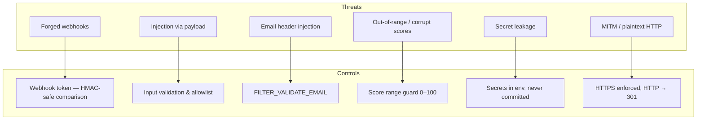
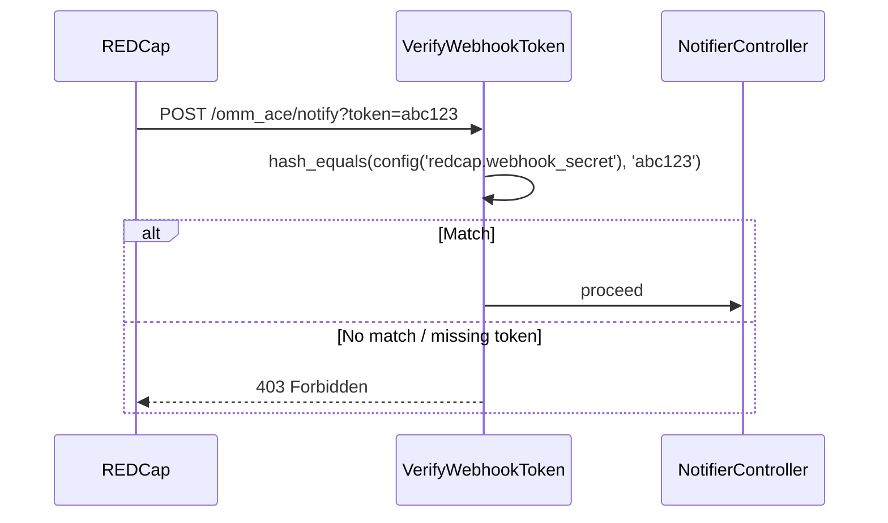
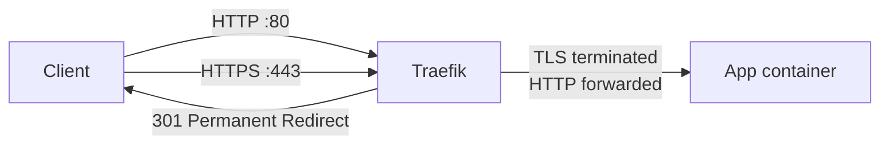

# Security

## Threat Model

The application has a small attack surface — it exposes one unauthenticated-looking endpoint (`/notify`) and makes outbound API calls to REDCap and an SMTP server. It stores no passwords, no PII beyond what is transiently in memory during a request, and no database.



---

## 1. Webhook Authentication

### How It Works

The REDCap Data Entry Trigger URL must include a `?token=` query parameter matching `WEBHOOK_SECRET`. The middleware validates it on every `POST /notify` request.



`hash_equals()` is used instead of `===` to prevent [timing attacks](https://codahale.com/a-lesson-in-timing-attacks/) — the comparison takes the same time regardless of where the strings diverge.

### Generating a Secret

```bash
openssl rand -hex 32
# e.g. 7f4a2b91c3d8e05f6a1b9c7d2e4f8a3b...
```

Set in `.env`:
```
WEBHOOK_SECRET=7f4a2b91c3d8e05f6a1b9c7d2e4f8a3b...
```

Configure the REDCap DET URL as:
```
https://your-server.example.com/omm_ace/notify?token=7f4a2b91c3d8e05f6a1b9c7d2e4f8a3b...
```

### Local / CI Bypass

When `WEBHOOK_SECRET` is empty (`.env.example` default), the check is skipped entirely. This allows tests and local development to work without configuring a secret.

```php
// VerifyWebhookToken.php
if ($secret && ! hash_equals($secret, (string) $request->query('token', ''))) {
    abort(403);
}
```

**Never leave `WEBHOOK_SECRET` empty in production.**

---

## 2. HTTPS Enforcement

All traffic is HTTPS-only. Traefik enforces this at the edge before any request reaches the application.



Two Traefik routers are registered via Docker labels:

| Router | Entrypoint | Action |
|--------|-----------|--------|
| `omm-se-http` | `web` (:80) | Redirect to HTTPS — permanent (301) |
| `omm-se` | `websecure` (:443) | Strip prefix, forward to app |

This is enforced at the infrastructure level — the app itself never sees an HTTP request.

---

## 3. Input Validation

### Webhook Payload

The `record` parameter from REDCap is treated as untrusted input:


### REDCap Filter Injection

`scholar_name` and `semester` are interpolated into REDCap's `filterLogic` string. Both are validated against strict allowlists before use:

```php
// RedcapSourceService::getScholarEvals()
if (! preg_match('/^\d+$/', $scholarName) || ! preg_match('/^[12]$/', $semester)) {
    return [];  // Reject — no API call made
}
```

- `scholar_name` must be all digits
- `semester` must be exactly `1` or `2`

A payload like `scholar_name = "1' OR '1'='1"` returns an empty array immediately.

### Score Range Validation

Calculated scores from REDCap are expected to be 0–100. Any value outside this range is logged and excluded from aggregation:

```php
if ($score < 0.0 || $score > 100.0) {
    Log::warning("Score {$score} out of range for {$scoreField}, skipping.");
    continue;
}
```

---

## 4. Email Header Injection Prevention

Faculty and scholar email addresses arrive from REDCap (untrusted). Both are validated with PHP's `FILTER_VALIDATE_EMAIL` before being passed to the mailer:

```php
$scholarEmail = filter_var($fullScholarRecord['email'] ?? '', FILTER_VALIDATE_EMAIL) ?: null;
$facultyEmail = filter_var($evalRecord['faculty_email'] ?? '', FILTER_VALIDATE_EMAIL) ?: null;
```

A malformed address (including one with embedded newlines) is silently discarded — the email is sent without CC, or not sent at all if the scholar address is invalid.

---

## 5. CSRF Exemption (Secure)

The `/notify` route is exempt from Laravel's CSRF middleware because REDCap cannot include a CSRF token. This is safe because:

1. The endpoint is protected by the webhook shared secret instead
2. Successful exploitation requires knowing `WEBHOOK_SECRET`, which is never exposed to clients

```php
// bootstrap/app.php
$middleware->validateCsrfTokens(except: ['/notify']);
```

---

## 6. Secret Management

| Secret | Where it lives | Notes |
|--------|---------------|-------|
| `APP_KEY` | `.env` | Never commit — generate with `php artisan key:generate` |
| `REDCAP_TOKEN` | `.env` | Destination project API token |
| `REDCAP_SOURCE_TOKEN` | `.env` | Source project API token — update each academic year |
| `WEBHOOK_SECRET` | `.env` | Shared with REDCap DET URL only |
| `MAIL_PASSWORD` | `.env` | SMTP credential |
| `DOCKERHUB_TOKEN` | GitHub Secret | Never in code or `.env` |
| `SSH_KEY` | GitHub Secret | Private key for deploy SSH access |

**Rules:**
- `.env` is in `.gitignore` — never committed
- `.env.example` contains no real values — safe to commit
- All config values accessed via `config()` in application code, never `env()` directly
- REDCap tokens appear only in `config/redcap.php` and the `.env` file

---

## 7. Nginx Security Headers

The following headers are set on all responses (`docker/nginx/default.conf`):

| Header | Value | Protection |
|--------|-------|-----------|
| `X-Frame-Options` | `SAMEORIGIN` | Clickjacking |
| `X-Content-Type-Options` | `nosniff` | MIME-type sniffing |
| `X-XSS-Protection` | `1; mode=block` | Reflected XSS (legacy browsers) |

Static assets are served with `Cache-Control: public, max-age=31536000, immutable` (1 year) because Vite appends content hashes to filenames.

---

## 8. Docker Attack Surface

| Practice | Applied |
|----------|--------|
| Alpine base image | Minimal OS, small attack surface |
| Multi-stage build | No build tools (npm, Composer) in the runtime image |
| `www-data` ownership | `storage/` and `bootstrap/cache/` owned by `www-data` only |
| No exposed ports | App container has no `ports:` mapping — only reachable via Traefik on the Docker network |
| No database | No MySQL to harden, patch, or credential-rotate |
| Read-only vendor | `vendor/` baked into image at build time, not mounted |

---

## Security Checklist for New Deployments

- [ ] `WEBHOOK_SECRET` set to a 32-byte random hex value
- [ ] `APP_KEY` generated (`php artisan key:generate --show`)
- [ ] `APP_DEBUG=false` in production `.env`
- [ ] `APP_ENV=production` in production `.env`
- [ ] Traefik configured with valid TLS certificate
- [ ] REDCap DET URL uses `https://` with the `?token=` parameter
- [ ] GitHub Secrets configured: `DOCKERHUB_USERNAME`, `DOCKERHUB_TOKEN`, `SSH_HOST`, `SSH_USER`, `SSH_KEY`
- [ ] SSH deploy key has minimal permissions (deploy user, no sudo)
- [ ] `.env` file on server is `chmod 600`
