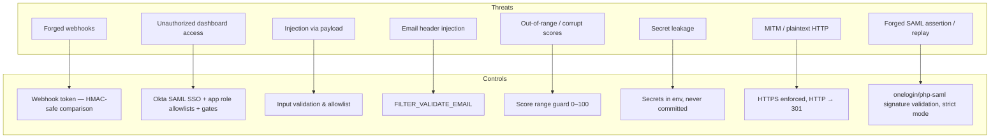
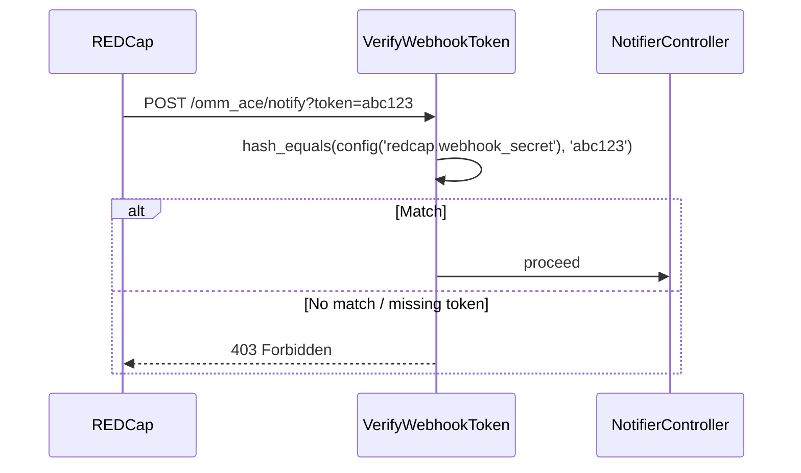
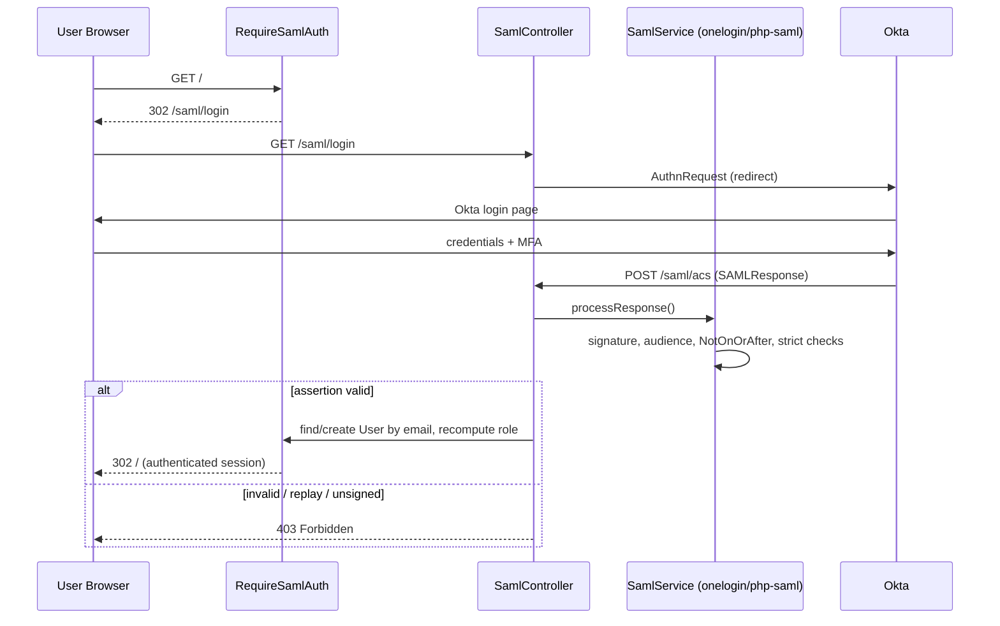
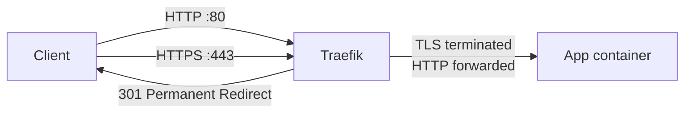
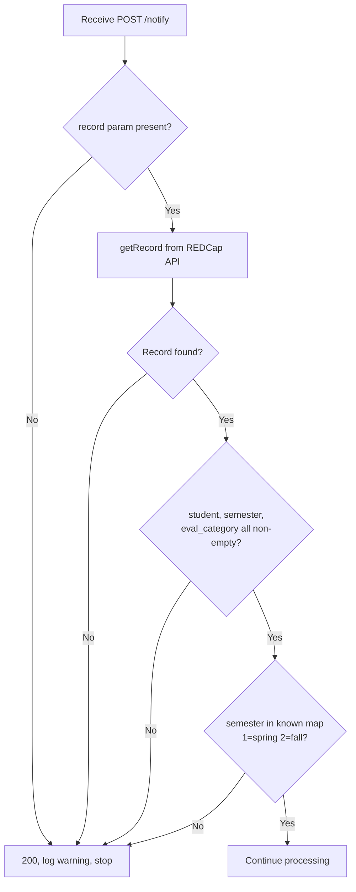

# Security

## Threat Model

The application exposes a REDCap-facing webhook endpoint (`/notify`), a set of SAML endpoints (`/saml/login`, `/saml/acs`, `/saml/logout`, `/saml/metadata`), and interactive app pages protected by an authenticated session. It makes outbound API calls to REDCap and an SMTP server. User identity comes from Okta via SAML SSO; authorization is resolved inside the app against env-managed allowlists plus the REDCap destination project (scholar roster).



---

## 1. Webhook Authentication

### How It Works

The REDCap Data Entry Trigger URL must include a `?token=` query parameter matching `WEBHOOK_SECRET`. The middleware validates it on every `POST /notify` request.



`hash_equals()` is used instead of `===` to prevent [timing attacks](https://codahale.com/a-lesson-in-timing-attacks/) — the comparison takes the same time regardless of where the strings diverge.

### Generating a Secret

```bash
openssl rand -hex 32
# e.g. 7f4a2b91c3d8e05f6a1b9c7d2e4f8a3b...
```

Set in `.env`:
```
WEBHOOK_SECRET=7f4a2b91c3d8e05f6a1b9c7d2e4f8a3b...
```

Configure the REDCap DET URL as:
```
https://your-server.example.com/omm_ace/notify?token=7f4a2b91c3d8e05f6a1b9c7d2e4f8a3b...
```

### Local / CI Bypass

When `WEBHOOK_SECRET` is empty (`.env.example` default), the check is skipped entirely. This allows tests and local development to work without configuring a secret.

```php
// VerifyWebhookToken.php
if ($secret && ! hash_equals($secret, (string) $request->query('token', ''))) {
    abort(403);
}
```

**Never leave `WEBHOOK_SECRET` empty in production.**

---

## 2. Authentication — Okta SAML SSO

Interactive pages (`/`, `/scholar`, `/process/*`, `/admin/*`) are protected by `RequireSamlAuth`. Unauthenticated requests are redirected to `/saml/login`, which hands off to Okta. Okta posts the SAML assertion back to `/saml/acs`; the app validates it via `onelogin/php-saml`, extracts the user's email, and establishes a Laravel session.



**Trust model:** the app trusts only the `email` attribute from the IdP. No groups, roles, or other claims are honored. Email is the stable identifier; `displayName` is used only for UI.

Relevant env (see `.env.example`):

```bash
SAML_IDP_ENTITY_ID=
SAML_IDP_SSO_URL=
SAML_IDP_SLO_URL=
SAML_IDP_X509_CERT=
SAML_SP_ENTITY_ID="${APP_URL}/saml/metadata"
SAML_SP_ACS_URL="${APP_URL}/saml/acs"
SAML_SP_SLO_URL="${APP_URL}/saml/logout"
SAML_STRICT=true
SAML_DEBUG=false
SAML_ATTR_EMAIL=email
SAML_ATTR_NAME=displayName
```

`SAML_STRICT=true` enforces signed responses, audience restriction, and timing windows. `SAML_SP_X509_CERT` / `SAML_SP_PRIVATE_KEY` are only required when signed AuthnRequests or encrypted assertions are enabled in the Okta app.

---

## 2a. Authorization — Application Role Model

Once authenticated, each user is assigned a role from `App\Enums\Role`:

| Role | Source | Access |
|------|--------|--------|
| `Service` | Email in `SERVICE_USERS=` | Everything — dashboard, all scholars, run process, user management (`/admin/users`) |
| `Admin` | Email in `ADMIN_USERS=` | Dashboard + all scholar records; **no** user management |
| `Student` | Email matches a scholar in the destination project (OMMScholarEvalList) | Own scholar record only |

Rules:

- `SERVICE_USERS` / `ADMIN_USERS` are comma-separated emails, case-insensitive.
- On every SAML login, the app recomputes the role from the current env allowlists — demotions/promotions take effect on the next sign-in.
- Students auto-provision via `RedcapDestinationService::findScholarByEmail()`; the matched REDCap `record_id` is cached on the `users` row (`redcap_record_id`).
- If an email is not on any allowlist **and** does not match a scholar record, the app returns `HTTP 404` rendering `resources/views/auth/records-not-found.blade.php`. This intentionally does not expose whether the user authenticated successfully against Okta.

Authorization is enforced in controllers and views through four gates registered in `AppServiceProvider`:

| Gate | Service | Admin | Student |
|------|:--:|:--:|:--:|
| `view-dashboard` | ✅ | ✅ | ❌ |
| `view-all-scholars` | ✅ | ✅ | ❌ (own record only) |
| `run-process` | ✅ | ✅ | ❌ |
| `manage-users` | ✅ | ❌ | ❌ |

---

## 3. HTTPS Enforcement

All traffic is HTTPS-only. Traefik enforces this at the edge before any request reaches the application.



Two Traefik routers are registered via Docker labels:

| Router | Entrypoint | Action |
|--------|-----------|--------|
| `omm-se-http` | `web` (:80) | Redirect to HTTPS — permanent (301) |
| `omm-se` | `websecure` (:443) | Strip prefix, forward to app |

This is enforced at the infrastructure level — the app itself never sees an HTTP request.

---

## 4. Input Validation

### Webhook Payload

The `record` parameter from REDCap is treated as untrusted input:



### REDCap Filter Injection

`student` and `semester` are interpolated into REDCap's `filterLogic` string. Both are validated against strict allowlists before use:

```php
// RedcapSourceService::getScholarEvals()
if (! preg_match('/^\d+$/', $datatelId) || ! preg_match('/^[12]$/', $semester)) {
    return [];  // Reject — no API call made
}
```

- `student` / datatelid must be all digits
- `semester` must be exactly `1` or `2`

A payload like `student = "1' OR '1'='1"` returns an empty array immediately.

### Score Range Validation

Calculated scores from REDCap are expected to be 0–100. Any value outside this range is logged and excluded from aggregation:

```php
if ($score < 0.0 || $score > 100.0) {
    Log::warning("Score {$score} out of range for {$scoreField}, skipping.");
    continue;
}
```

---

## 5. Email Header Injection Prevention

Faculty and scholar email addresses arrive from REDCap (untrusted). Both are validated with PHP's `FILTER_VALIDATE_EMAIL` before being passed to the mailer:

```php
$scholarEmail = filter_var($fullScholarRecord['email'] ?? '', FILTER_VALIDATE_EMAIL) ?: null;
$facultyEmail = filter_var($evalRecord['faculty_email'] ?? '', FILTER_VALIDATE_EMAIL) ?: null;
```

A malformed address (including one with embedded newlines) is silently discarded — the email is sent without CC, or not sent at all if the scholar address is invalid.

---

## 6. CSRF Exemption (Secure)

The `/notify` and `/saml/acs` routes are exempt from Laravel's CSRF middleware because neither REDCap nor Okta can include a Laravel CSRF token. This is safe because:

1. `/notify` is protected by the webhook shared secret (`hash_equals`).
2. `/saml/acs` accepts only signed SAML assertions validated by `onelogin/php-saml` in strict mode (signature, audience, and `NotOnOrAfter` checks).
3. Successful exploitation requires either knowing `WEBHOOK_SECRET` or forging a valid Okta-signed assertion.

```php
// bootstrap/app.php
$middleware->validateCsrfTokens(except: ['/notify', '/saml/acs']);
```

---

## 7. Secret Management

| Secret | Where it lives | Notes |
|--------|---------------|-------|
| `APP_KEY` | `.env` | Never commit — generate with `php artisan key:generate` |
| `REDCAP_TOKEN` | `.env` | Destination project API token |
| `REDCAP_SOURCE_TOKEN` | `.env` | Source project API token — update each academic year |
| `REDCAP_TOKEN_PID_<pid>` | `.env` | Source project token keyed by REDCap PID |
| `WEBHOOK_SECRET` | `.env` | Shared with REDCap DET URL only |
| `SAML_IDP_X509_CERT` | `.env` | Okta signing certificate — validates SAML assertions |
| `SAML_SP_PRIVATE_KEY` | `.env` | Optional — only if signed AuthnRequests/encrypted assertions are enabled |
| `SERVICE_USERS` / `ADMIN_USERS` | `.env` | App role allowlists (comma-separated emails) |
| `DB_PASSWORD` / `MYSQL_ROOT_PASSWORD` | `.env` | MySQL credentials |
| `MAIL_PASSWORD` | `.env` | SMTP credential |
| `DOCKERHUB_TOKEN` | GitHub Secret | Never in code or `.env` |
| `SSH_KEY` | GitHub Secret | Private key for deploy SSH access |

**Rules:**
- `.env` is in `.gitignore` — never committed
- `.env.example` contains no real values — safe to commit
- All config values accessed via `config()` in application code, never `env()` directly
- REDCap tokens appear only in `config/redcap.php` and the `.env` file; SAML values only in `config/saml.php` and the `.env` file

---

## 8. Nginx Security Headers

The following headers are set on all responses (`docker/nginx/default.conf`):

| Header | Value | Protection |
|--------|-------|-----------|
| `X-Frame-Options` | `SAMEORIGIN` | Clickjacking |
| `X-Content-Type-Options` | `nosniff` | MIME-type sniffing |
| `X-XSS-Protection` | `1; mode=block` | Reflected XSS (legacy browsers) |

Static assets are served with `Cache-Control: public, max-age=31536000, immutable` (1 year) because Vite appends content hashes to filenames.

---

## 9. Docker Attack Surface

| Practice | Applied |
|----------|--------|
| Alpine base image | Minimal OS, small attack surface |
| Multi-stage build | No build tools (npm, Composer) in the runtime image |
| `www-data` ownership | `storage/` and `bootstrap/cache/` owned by `www-data` only |
| No exposed ports | App container has no `ports:` mapping — only reachable via Traefik on the Docker network |
| MySQL not publicly exposed | `omm-ace-mysql` is reachable only on the internal Docker network; volume bind-mounted on the host with restrictive perms |
| Read-only vendor | `vendor/` baked into image at build time, not mounted |

---

## Security Checklist for New Deployments

- [ ] `WEBHOOK_SECRET` set to a 32-byte random hex value
- [ ] `REDCAP_TOKEN_PID_<pid>` set for each source project
- [ ] Okta SAML app created; `SAML_IDP_ENTITY_ID`, `SAML_IDP_SSO_URL`, `SAML_IDP_SLO_URL`, `SAML_IDP_X509_CERT` populated from Okta
- [ ] `SAML_SP_ENTITY_ID`, `SAML_SP_ACS_URL`, `SAML_SP_SLO_URL` match the Okta app configuration
- [ ] `SAML_STRICT=true` and `SAML_DEBUG=false` in production
- [ ] `SERVICE_USERS` / `ADMIN_USERS` populated with the real operators' emails
- [ ] `APP_KEY` generated (`php artisan key:generate --show`)
- [ ] `APP_DEBUG=false` and `APP_ENV=production` in production `.env`
- [ ] MySQL credentials (`DB_PASSWORD`, `MYSQL_ROOT_PASSWORD`) generated and not defaults
- [ ] Traefik configured with valid TLS certificate
- [ ] REDCap DET URL uses `https://` with the `?token=` parameter
- [ ] GitHub Secrets configured: `DOCKERHUB_USERNAME`, `DOCKERHUB_TOKEN`, `SSH_HOST`, `SSH_USER`, `SSH_KEY`
- [ ] SSH deploy key has minimal permissions (deploy user, no sudo)
- [ ] `.env` file on server is `chmod 600`
- [ ] `GET /test/email` route guarded behind `app()->environment('local')` or removed before deploy (currently public — see security note below)

---

## Admin Surface Threats

The Service-only `/admin/*` routes introduce additional attack surface beyond the webhook + scholar views.

| Surface | Risk | Mitigation |
|---------|------|------------|
| `POST /admin/users/import` | Long-running synchronous REDCap roster fetch; can hang the request thread | Service-only via `can:manage-users`; consider migrating to a queued job |
| `POST /admin/users/import-csv` (Livewire) | Untrusted CSV upload; malformed rows or oversize files | 1 MB file size cap, MIME `csv,txt` validation, per-cell validation, transaction-wrapped insert. Consider a server-side `Storage::mimeType()` re-check |
| `POST /admin/users/{user}/impersonate` | Privilege escalation if Service account compromised | Cannot impersonate Service users; cannot self-impersonate; persistent banner shown; session-only — closing the browser ends impersonation. The `/impersonate/stop` route sits **outside** the `manage-users` gate so an impersonated user can always exit |
| `POST /admin/settings/project-mappings/*` | Settings tampering could redirect aggregation to wrong destination | Gated by `manage-settings` and CRUD operations sub-gated by `manage-settings-records` |
| `GET /test/email` (current) | **Open route** that renders an evaluation email with stubbed-but-realistic faculty/scholar PII patterns; usable for phishing template harvesting | **Action required**: wrap in `if (app()->environment('local'))` block in `routes/web.php`, mirroring `/local/login` |

### Impersonation audit logging

Impersonation start/stop events update the standard Laravel `last_login_at` flow but are **not** persisted to a dedicated audit log. If compliance requires a tamper-evident trail, add a `user_audit_events` table or stream events to the application log via a `LoginImpersonated` event listener.
