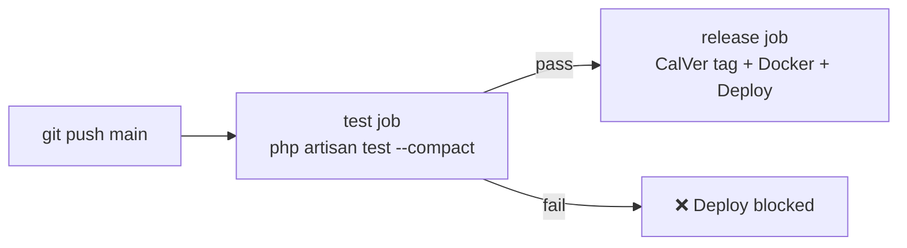

# Testing

## Overview

The test suite uses [Pest 4](https://pestphp.com/) and covers unit and feature layers. `RefreshDatabase` is enabled globally — each test runs in a transaction that is rolled back. REDCap API calls are mocked via Mockery.

```mermaid
graph TD
    subgraph Unit Tests
        U1[RedcapSourceServiceTest]
        U2[RedcapDestinationServiceTest]
        U3[EvaluationNotificationTest]
        U4[EvalAggregatorTest]
        U5[SemesterSlotTest]
    end
    subgraph Feature Tests
        F1[NotifierControllerTest]
        F2[DashboardControllerTest]
        F3[StudentControllerTest]
        F4[ProcessControllerTest]
        F5[SamlServiceTest]
        F6[SamlMetadataRouteTest]
        F7[RoleAuthorizationTest]
        F8[AppServiceProviderTest]
        F9[AdminUserControllerTest]
        F10[SettingsControllerTest]
        F11[FacultyControllerTest]
        F12[Console command tests]
        F13[AcademicYearWizardTest]
        F14[ImportScholarsJobTest]
        F15[EmailTemplateTest]
        F16[ReprocessCardTest]
        F17[DocsViewerTest]
        F18[CsvUserImportTest]
    end

    U1 -->|tests| SRC[RedcapSourceService]
    U2 -->|tests| MAIL[EvaluationNotification]
    F1 -->|mocks| NC[NotifierController]
    F2 & F3 & F4 -->|mocks| DST[RedcapDestinationService]
    F5 -->|unit-style| SS[SamlService]
    F6 -->|authorization| MW[RequireSamlAuth + Gates]
    F7 -->|CRUD| UC[Admin\\UserController]
```



---

## Running Tests

```bash
# Full suite
php artisan test --compact

# Single test by name
php artisan test --compact --filter="aggregates scores"

# Single file
php artisan test --compact tests/Feature/NotifierControllerTest.php

# Unit tests only
php artisan test --compact tests/Unit/
```

---

## Auth Helpers

`tests/Pest.php` exposes three global helpers for authenticating test users. All use the `User` factory and automatically call `actingAs()`:

```php
asService()              // creates + acts as a Service-role user
asAdmin()                // creates + acts as an Admin-role user
asStudent('record-id')   // creates + acts as a Student with the given redcap_record_id
```

Use these in `beforeEach` to cover entire test files, or per-test for mixed-role scenarios.

---

## Test Structure

### Unit: `RedcapSourceServiceTest`

Tests `app/Services/RedcapSourceService.php` in isolation — no HTTP calls.

| Test | What it verifies |
|------|-----------------|
| `SCORE_FIELDS` constant | Maps A/B/C/D to the correct source field names |
| `CATEGORY_LABELS` constant | Maps A/B/C/D to human-readable labels |
| `DEST_CATEGORY` constant | Maps A/B/C/D to destination field suffixes |
| All constants share the same keys | A/B/C/D present in all three constants |
| Rejects non-numeric datatelid | `getStudentEvals("1' OR '1'='1", '1', 2026, $token)` → `[]` |
| Rejects invalid semester code | `getStudentEvals('1', '9', 2026, $token)` → `[]` |
| Rejects injection in semester | `getStudentEvals('1', "1' OR '1'='1", 2026, $token)` → `[]` |
| Year-filters in PHP | Records whose `date_lab` year ≠ `$year` are dropped after the REDCap export |

### Unit: `EvaluationNotificationTest`

Tests `app/Mail/EvaluationNotification.php` and `resources/views/emails/evaluation.blade.php`.

| Test | What it verifies |
|------|-----------------|
| Subject line per category | Subject contains the category label (Teaching / Clinic / Research / Didactics) |
| `CRITERIA` — Teaching (A) | 5 criteria fields defined |
| `CRITERIA` — Clinic (B) | 14 criteria fields defined |
| `CRITERIA` — Research (C) | 8 criteria fields defined |
| `CRITERIA` — Didactics (D) | 6 criteria fields defined |
| `SCORE_SCALE` keys match categories | Scale entries for A/B/C/D |
| Uses markdown view | Content builds from `emails.evaluation` |
| View receives required data keys | `criteria`, `scoreScale`, `categoryLabel`, `scoreField` present |
| Greeting uses `goes_by` when set | "Dear Cat," not "Dear Catherine," |
| Greeting falls back to `first_name` | When `goes_by` is empty |
| Comments panel rendered when present | Faculty feedback block appears |
| Comments panel omitted when absent | Block not rendered for empty comments |
| Semester summary shows all 4 categories | Table rows for teaching / clinic / research / didactics |
| Null avg renders as dash | Categories with 0 evals show "—" not "0%" |
| No attachments | `assertHasNoAttachments()` |

### Feature: `SamlServiceTest`

Tests `app/Services/SamlService.php` role resolution and user provisioning.

| Test | What it verifies |
|------|-----------------|
| Service allowlist | Email in `SERVICE_USERS` → `Role::Service` |
| Admin allowlist | Email in `ADMIN_USERS` → `Role::Admin` |
| Default Student | Unknown email → `Role::Student` |
| Create user | `loginFromAssertion` creates user, lowercases email, sets `last_login_at`, logs in |
| Role promotion on re-login | Allowlist change is picked up on next sign-in |
| Empty email rejected | Throws `RuntimeException` |

### Feature: `RoleAuthorizationTest`

Tests gate enforcement across all protected routes.

| Test | What it verifies |
|------|-----------------|
| Student → dashboard redirect | `GET /` redirects to `/student` for students |
| Service/Admin → dashboard | `GET /` returns 200 for elevated roles |
| Student own record | `GET /student` returns only their record; `lock_selection` is true |
| Student 404 | No matching REDCap record → 404 |
| Student `?id` override blocked | Query string is ignored; own record always shown |
| Non-Service → process 403 | `GET /process/{pid}` returns 403 |
| Admin/Student → admin UI 403 | `GET /admin/users` returns 403 |
| Service → admin UI 200 | `GET /admin/users` returns 200 |
| Self-delete blocked | Service user cannot delete their own account |

### Feature: `AdminUserControllerTest`

Tests `app/Http/Controllers/Admin/UserController.php`.

| Test | What it verifies |
|------|-----------------|
| Index lists all users | Email, name, role visible |
| Edit form renders | User email shown; role pre-selected |
| Update role + REDCap ID | `PATCH` persists new role and `redcap_record_id` |
| Invalid role rejected | Validation error on unknown role value |
| Clear REDCap ID | Blank input stores `null` |

### Feature: `NotifierControllerTest`

Tests the full webhook flow via HTTP. REDCap services are mocked; mail is faked.

#### Webhook Token Authentication

| Test | Expected |
|------|---------|
| Invalid token | 403 Forbidden |
| Missing token | 403 Forbidden |
| Correct token | 200 OK |
| No secret configured | 200 OK (check bypassed) |

#### Edge Cases

| Test | Expected |
|------|---------|
| Missing `record` param | 200, no email |
| Record not found in source | 200, no email |
| Eval missing `student` field | 200, no email |
| Unknown semester code | 200, no email |
| No destination student record | 200, no email |

#### Email Delivery

| Test | Expected |
|------|---------|
| Happy path | `EvaluationNotification` sent |
| `To:` address | Student's email |
| `CC:` address | Faculty email |
| `BCC:` address | `MAIL_FROM_ADDRESS` (admin) |
| Student email empty | No email sent |
| Student email malformed | No email sent |
| Faculty email malformed | Email sent, CC omitted |

#### Score Aggregation

| Test | Expected |
|------|---------|
| Multiple evals same category | `nu=2`, `avg=mean` |
| Score below 0 | Skipped, not counted |
| Score above 100 | Skipped, not counted |
| Category with zero evals | `nu=0`, no `avg` key in payload |
| Semester code `'2'` | Fields prefixed `fall_`, not `spring_` |

#### Comments

| Test | Expected |
|------|---------|
| Multiple comments | `nu_comments` = count, `comments` concatenated as `[Faculty]: text` |
| Empty comment field | Not included in count |

### Feature: `ExampleTest`

| Test | Expected |
|------|---------|
| Unauthenticated request | `GET /` redirects to `/saml/login` |

### Feature: `AcademicYearWizardTest`

Tests the 2-step `<x-admin.⚡academic-year-wizard>` Livewire component rendered at `/admin/settings/source-project/create`.

| Test | What it verifies |
|------|-----------------|
| Saves project mapping | Step 1 persists encrypted token + `ProjectMapping` row and flips the previous active mapping to `is_active = 0` |
| Validates input | `redcap_pid` required, integer, unique among non-deleted rows; `redcap_token` required |
| Import disabled before mapping | "Start import" cannot run until `savedProjectMappingId` is set |
| Dispatches `ImportScholarsJob` | Step 2 queues `ImportScholarsJob::dispatchAfterResponse(jobId, mappingId)` and seeds the cache key `import_scholars:{jobId}` |

### Feature: `ImportScholarsJobTest`

Tests `app/Jobs/ImportScholarsJob.php`.

| Test | What it verifies |
|------|-----------------|
| Creates new students | `User` rows are created for destination records whose email is not yet in the `users` table |
| Updates existing students | Existing users (including soft-deleted) get their `name`, `redcap_record_id`, and cohort fields refreshed |
| Tracks missing emails | Records with no email captured under `missing_email[]` |
| Updates cache state | `import_scholars:{jobId}` reflects `pending` → `running` → `complete` |
| Handles errors | Catches `Throwable`; sets `status = failed` and `error` message |

### Feature: `DocsViewerTest`

Tests the `com-atg/laravel-docs-viewer` integration at `/admin/docs`.

| Test | What it verifies |
|------|-----------------|
| Service-only auth | Non-Service users → 403 |
| Index lists docs | All `Docs/*.md` plus `README.md` rendered as entries |
| Shows a doc | Markdown rendered into `<x-app-shell>` with `.docs-prose` styles |
| Unknown slug 404s | Bad slug returns 404 |

### Feature: `CsvUserImportTest`

Tests `app/Livewire/Admin/CsvUserImport.php`.

| Test | What it verifies |
|------|-----------------|
| Parses headers + rows | Supports UTF-8 BOM |
| Per-cell live validation | Name/email/role validated on blur |
| Role normalization | `service` / `admin` / `faculty` / `student` (case-insensitive) |
| Duplicate emails skipped | Existing user → warning, not error |
| Bulk create in transaction | Partial failure rolls back |
| File-level errors | Missing headers, > 1 MB, malformed CSV |

### Modified: `SettingsControllerTest`

In addition to the original project-mapping CRUD coverage, the suite now exercises the email-template editor surface (`email_template` AppSetting load + `MailTemplateRenderer` preview rendering), the wizard entry-point at `/admin/settings/source-project/create`, the `activate` action that flips `is_active`, and the synchronous `importStudents` re-run that upserts cohort fields onto existing users.

### Unit: `RedcapDestinationServiceTest`

Covers `findStudentByDatatelId` (filterLogic + 1-hour cache + cohort fields returned), `findStudentByEmail`, `getActiveStudentRecords`, `availableBatches`, and `studentMapByDatatelId`.

### Unit: `EvalAggregatorTest`

Covers the `sem{n}_*` field shape: per-category sums/counts/averages, date entries (`Faculty, M/D/YYYY`), comments serialization, and out-of-range / empty score handling.

### Unit: `SemesterSlotTest`

Covers `compute(semester, dateLab, cohortTerm, cohortYear)` over the in-window and out-of-window cases, `slotKey`, `labelsFor`, and `yearFromDate` for both `MM-DD-YYYY` and `YYYY-MM-DD` inputs.

### Feature: `AppServiceProviderTest`

Exercises every gate registered in `AppServiceProvider::boot()` against each role to confirm the matrix in [Security](security.md#2a-authorization-application-role-model) holds.

### Feature: `SamlMetadataRouteTest`

Confirms `GET /saml/metadata` is reachable without session middleware, returns XML, and that the Service Provider entity ID matches `config('saml.sp.entityId')`.

### Feature: `EmailTemplateTest`

Covers the inline email-template editor on `/admin/settings`: gate enforcement (`edit-email-template` allows Service + Admin), saving / restoring the `AppSetting('email_template')` value, cache invalidation, and that `EvaluationNotification::content()` honours the override.

### Feature: `ReprocessCardTest`

Exercises the reprocess-card panel on the dashboard / settings page that triggers `ProcessSourceProjectJob` for a chosen mapping and polls its cache-backed status.

---

## Mocking Pattern

Feature tests use `Pest\Laravel\mock()` to replace service classes in the container:

```php
use function Pest\Laravel\mock;

$source = mock(RedcapSourceService::class);
$source->shouldReceive('getRecord')->andReturn(sourceEvalRecord());
$source->shouldReceive('getStudentEvals')->andReturn([sourceEvalRecord()]);

$destination = mock(RedcapDestinationService::class);
$destination->shouldReceive('findStudentByDatatelId')->with('1')->andReturn(destStudentRecord());
$destination->shouldReceive('updateStudentRecord')->andReturn('1');
```

`Mail::fake()` is used to assert mail was (or was not) sent without actually delivering anything:

```php
Mail::fake();
// ... trigger webhook ...
Mail::assertSent(EvaluationNotification::class, fn($mail) => $mail->hasTo('student@example.com'));
Mail::assertNothingSent();
```

---

## Test Helpers

Shared fixtures defined at the top of `NotifierControllerTest.php`:

```php
// Builds a source eval record with sensible defaults
function sourceEvalRecord(string $category = 'A', array $overrides = []): array

// Builds a destination student record
function destStudentRecord(array $overrides = []): array

// Wires up both service mocks with a single call
function mockServices(array $evalRecord, array $allEvals, ?array $destRecord): void
```

---

## CI Integration

Tests run automatically on every push to `main` before any release is tagged or Docker image is built — a failing test suite blocks the deployment:


