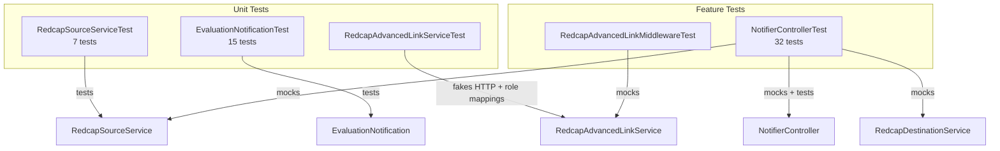
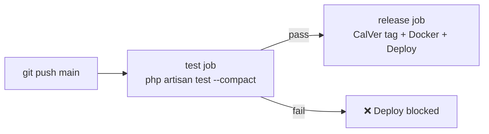

# Testing

## Overview

The test suite uses [Pest 4](https://pestphp.com/) and covers unit and feature layers. There are no database dependencies — all REDCap API calls are mocked via Mockery.



---

## Running Tests

```bash
# Full suite
php artisan test --compact

# Single test by name
php artisan test --compact --filter="aggregates scores"

# Single file
php artisan test --compact tests/Feature/NotifierControllerTest.php

# Unit tests only
php artisan test --compact tests/Unit/
```

---

## Test Structure

### Unit: `RedcapSourceServiceTest`

Tests `app/Services/RedcapSourceService.php` in isolation — no HTTP calls.

| Test | What it verifies |
|------|-----------------|
| `SCORE_FIELDS` constant | Maps A/B/C/D to the correct source field names |
| `CATEGORY_LABELS` constant | Maps A/B/C/D to human-readable labels |
| `DEST_CATEGORY` constant | Maps A/B/C/D to destination field suffixes |
| All constants share the same keys | A/B/C/D present in all three constants |
| Rejects non-numeric datatelid | `getScholarEvals("1' OR '1'='1", '1')` → `[]` |
| Rejects invalid semester code | `getScholarEvals('1', '9')` → `[]` |
| Rejects injection in semester | `getScholarEvals('1', "1' OR '1'='1")` → `[]` |

### Unit: `EvaluationNotificationTest`

Tests `app/Mail/EvaluationNotification.php` and `resources/views/emails/evaluation.blade.php`.

| Test | What it verifies |
|------|-----------------|
| Subject line per category | Subject contains the category label (Teaching / Clinic / Research / Didactics) |
| `CRITERIA` — Teaching (A) | 5 criteria fields defined |
| `CRITERIA` — Clinic (B) | 14 criteria fields defined |
| `CRITERIA` — Research (C) | 8 criteria fields defined |
| `CRITERIA` — Didactics (D) | 6 criteria fields defined |
| `SCORE_SCALE` keys match categories | Scale entries for A/B/C/D |
| Uses markdown view | Content builds from `emails.evaluation` |
| View receives required data keys | `criteria`, `scoreScale`, `categoryLabel`, `scoreField` present |
| Greeting uses `goes_by` when set | "Dear Cat," not "Dear Catherine," |
| Greeting falls back to `first_name` | When `goes_by` is empty |
| Comments panel rendered when present | Faculty feedback block appears |
| Comments panel omitted when absent | Block not rendered for empty comments |
| Semester summary shows all 4 categories | Table rows for teaching / clinic / research / didactics |
| Null avg renders as dash | Categories with 0 evals show "—" not "0%" |
| No attachments | `assertHasNoAttachments()` |

### Unit: `RedcapAdvancedLinkServiceTest`

Tests `app/Services/RedcapAdvancedLinkService.php`.

| Test | What it verifies |
|------|-----------------|
| Authorized role | Authkey identity + user role assignment returns REDCap user context |
| REDCap authkey exchange | Posts `authkey` and `format=json` as form data to `REDCAP_URL` |
| Unauthorized role | User outside `AUTHORIZED_ROLES` is rejected |
| Missing project token | `project_id` without `REDCAP_TOKEN_PID_<pid>` is rejected |

### Feature: `NotifierControllerTest`

Tests the full webhook flow via HTTP. REDCap services are mocked; mail is faked.

#### Webhook Token Authentication

| Test | Expected |
|------|---------|
| Invalid token | 403 Forbidden |
| Missing token | 403 Forbidden |
| Correct token | 200 OK |
| No secret configured | 200 OK (check bypassed) |

#### Edge Cases

| Test | Expected |
|------|---------|
| Missing `record` param | 200, no email |
| Record not found in source | 200, no email |
| Eval missing `student` field | 200, no email |
| Unknown semester code | 200, no email |
| No destination scholar record | 200, no email |

#### Email Delivery

| Test | Expected |
|------|---------|
| Happy path | `EvaluationNotification` sent |
| `To:` address | Scholar's email |
| `CC:` address | Faculty email |
| `BCC:` address | `MAIL_FROM_ADDRESS` (admin) |
| Scholar email empty | No email sent |
| Scholar email malformed | No email sent |
| Faculty email malformed | Email sent, CC omitted |

#### Score Aggregation

| Test | Expected |
|------|---------|
| Multiple evals same category | `nu=2`, `avg=mean` |
| Score below 0 | Skipped, not counted |
| Score above 100 | Skipped, not counted |
| Category with zero evals | `nu=0`, no `avg` key in payload |
| Semester code `'2'` | Fields prefixed `fall_`, not `spring_` |

#### Comments

| Test | Expected |
|------|---------|
| Multiple comments | `nu_comments` = count, `comments` concatenated as `[Faculty]: text` |
| Empty comment field | Not included in count |

### Feature: `RedcapAdvancedLinkMiddlewareTest`

Tests the protected interactive route flow.

| Test | Expected |
|------|---------|
| Valid authkey + authorized role | REDCap user context stored in session; launch redirects to dashboard |
| Existing authorized session | Protected route returns success |
| No authkey and no session | 403 Forbidden |
| Invalid/unauthorized authkey | 403 Forbidden |
| Middleware disabled | Protected route bypasses Advanced Link checks |

The global Pest bootstrap disables Advanced Link enforcement by default so existing feature tests do not depend on local `.env` values. The middleware tests explicitly enable it.

---

## Mocking Pattern

Feature tests use `Pest\Laravel\mock()` to replace service classes in the container:

```php
use function Pest\Laravel\mock;

$source = mock(RedcapSourceService::class);
$source->shouldReceive('getRecord')->andReturn(sourceEvalRecord());
$source->shouldReceive('getScholarEvals')->andReturn([sourceEvalRecord()]);

$destination = mock(RedcapDestinationService::class);
$destination->shouldReceive('findScholarByDatatelId')->with('1')->andReturn(destScholarRecord());
$destination->shouldReceive('updateScholarRecord')->andReturn('1');
```

`Mail::fake()` is used to assert mail was (or was not) sent without actually delivering anything:

```php
Mail::fake();
// ... trigger webhook ...
Mail::assertSent(EvaluationNotification::class, fn($mail) => $mail->hasTo('scholar@example.com'));
Mail::assertNothingSent();
```

---

## Test Helpers

Shared fixtures defined at the top of `NotifierControllerTest.php`:

```php
// Builds a source eval record with sensible defaults
function sourceEvalRecord(string $category = 'A', array $overrides = []): array

// Builds a destination scholar record
function destScholarRecord(array $overrides = []): array

// Wires up both service mocks with a single call
function mockServices(array $evalRecord, array $allEvals, ?array $destRecord): void
```

---

## CI Integration

Tests run automatically on every push to `main` before any release is tagged or Docker image is built — a failing test suite blocks the deployment:


