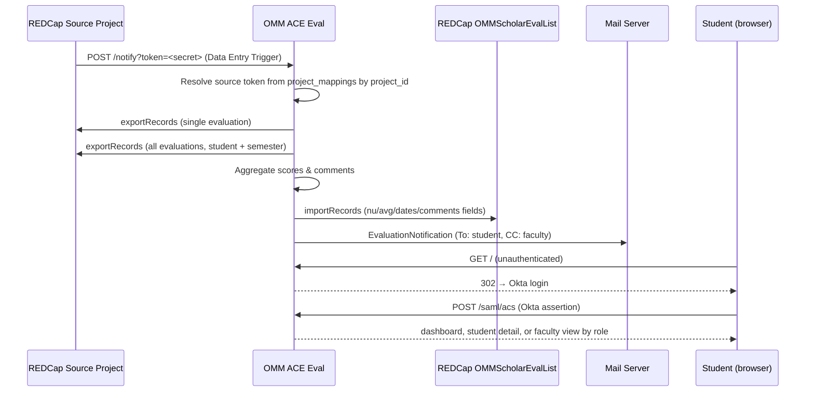

# OMM ACE Eval

A Laravel 13 app that receives student evaluation submissions from REDCap, computes per-category semester aggregates, writes them back to a permanent destination REDCap project, delivers email notifications to students and faculty, and exposes role-based dashboards protected by Okta SAML SSO.

---

## How It Works



---

## Stack

| Layer | Technology |
|-------|-----------|
| Framework | Laravel 13 / PHP 8.4 runtime |
| UI | Livewire 4, Flux 2, Tailwind CSS 4, Vite |
| Runtime | PHP-FPM + Nginx (Alpine, non-root, port 8080) |
| Process manager | Supervisor |
| Reverse proxy | Traefik (external) |
| Database | MySQL 8 |
| Sessions / Cache / Queue | Database driver |
| Authentication | Okta SAML 2.0 via `onelogin/php-saml` |
| Authorization | App-level role enum (Service / Admin / Faculty / Student) |
| Documentation viewer | `com-atg/laravel-docs-viewer` rendering `/Docs/*.md` + `README.md` at `/admin/docs` (Service-only) |
| Testing | Pest 4 |
| CI/CD | GitHub Actions |
| Containerisation | Docker (multi-stage) |
| Versioning | CalVer — `YYYY.HX.N` |

---

## Roles

| Role | Access |
|------|--------|
| **Service** | Everything: dashboard, all student records, faculty view, current or per-PID bulk aggregation, `/admin/users`, `/admin/settings`, CSV import, REDCap roster import, impersonation, email-template editor, `/admin/docs` documentation viewer |
| **Admin** | Dashboard, all student records, and faculty view. No user/settings management and no bulk processing. |
| **Faculty** | Dashboard and faculty view scoped to evaluations they authored, matched by faculty email or faculty name. |
| **Student** | Own student record only. Redirected from the dashboard to `/student`. |

Service and Admin users can be managed in the UI; `.env` allowlists (`SERVICE_USERS=`, `ADMIN_USERS=`) remain supported and are recomputed at login. Faculty and Student users can be created manually or imported. Students auto-provision on first SAML login if their email matches a record in the REDCap destination project. Unmatched users see a 404.

Roles are persisted on the `users` table via the `Role` enum (`Service`, `Admin`, `Faculty`, `Student`) and enforced through Gates: `view-dashboard`, `view-all-students`, `view-faculty-detail`, `view-student-page`, `run-process`, `manage-users`, `manage-settings`, `manage-settings-records`, `edit-email-template`, and `view-docs`.

---

## Documentation

These same files are also browsable in-app at **`/admin/docs`** (Service-only, served by `com-atg/laravel-docs-viewer`).

| Guide | Description |
|-------|-------------|
| [Architecture](Docs/architecture.md) | System design, component breakdown, SAML + webhook data flows |
| [REDCap Integration](Docs/redcap-integration.md) | Source/destination schemas, webhook setup, field mappings |
| [Admin Features](Docs/admin-features.md) | User management, CSV import, project-mapping settings, academic-year wizard, email-template editor, docs viewer, impersonation |
| [Local Development](Docs/local-development.md) | Docker setup, environment variables, simulating SSO login |
| [Testing](Docs/testing.md) | Pest test suite, auth helpers, test structure |
| [Production Deployment](Docs/production.md) | CI/CD pipeline, CalVer tagging, Docker Hub, SSH deploy, Okta setup |
| [Security](Docs/security.md) | SAML validation, role model, webhook auth, secrets management |

---

## Quick Start

```bash
# 1. Clone and install dependencies
git clone <repo-url> omm-se && cd omm-se
composer install && npm install

# 2. Configure environment
cp .env.example .env
php artisan key:generate
# Edit .env: set DB_*, REDCAP_URL, REDCAP_TOKEN, SAML_IDP_*, SERVICE_USERS
# Source project tokens are usually managed in /admin/settings project mappings.

# 3. Start the local stack (app + MySQL + Mailhog)
docker compose up -d

# 4. Run migrations and seed the default Service account
php artisan migrate --seed

# 5. Run tests
php artisan test --compact
```

See [Local Development](Docs/local-development.md) for the full setup guide, including the local login bypass and email preview route.

---

## Project Structure

```
app/
├── Enums/
│   ├── Role.php                         # Service / Admin / Faculty / Student
│   └── WeightCategory.php               # Final-score weighting categories
├── Http/
│   ├── Controllers/
│   │   ├── Admin/SettingsController.php # Project-mapping CRUD (Service only)
│   │   ├── Admin/UserController.php     # User management + REDCap import + CSV import dispatch + impersonation
│   │   ├── Auth/LocalLoginController.php# DEV-only SAML bypass (APP_ENV=local)
│   │   ├── Auth/SamlController.php      # SAML SSO (login / ACS / logout / metadata)
│   │   ├── DashboardController.php      # Cohort overview (Service/Admin/Faculty; students redirect)
│   │   ├── FacultyController.php        # Faculty-scoped roster view
│   │   ├── NotifierController.php       # REDCap webhook orchestrator
│   │   ├── ProcessController.php        # Bulk aggregation by PID (Service only)
│   │   └── StudentController.php        # Student roster + token-keyed detail (scoped by role)
│   └── Middleware/
│       ├── RequireSamlAuth.php          # SAML session guard
│       └── VerifyWebhookToken.php       # Shared-secret webhook auth
├── Livewire/
│   ├── Admin/CsvUserImport.php          # Drag-drop CSV → editable preview → bulk create
│   ├── Dashboard.php                    # Dashboard stats and academic-year filter
│   └── FacultyDetail.php                # Faculty-scoped evaluation detail
├── Models/
│   ├── AppSetting.php                   # Key/value app config (e.g. custom email template)
│   ├── CategoryWeight.php               # Final-score formula weights
│   ├── ProjectMapping.php               # Source/destination REDCap PID mapping
│   └── User.php                         # Role enum + soft deletes + UUID public_token
├── Providers/AppServiceProvider.php     # Gate definitions
└── Services/
    ├── SamlService.php                  # Role resolution + user provisioning
    ├── RedcapSourceService.php          # Per-project source REDCap API
    └── RedcapDestinationService.php     # OMMScholarEvalList API

app/Jobs/
├── ImportScholarsJob.php                # Queued student import for a project mapping (cache-backed status)
└── ProcessSourceProjectJob.php          # Queued bulk aggregation with cache-backed status

app/Support/
├── EvalAggregator.php                   # Shared aggregation logic for webhook, job, and command
└── FinalScoreFormulaParser.php          # Parses destination REDCap calculated-score formulas

config/
├── docs-viewer.php                      # Service-only `/admin/docs` viewer config
├── redcap.php
└── saml.php

resources/
├── css/
│   ├── app.css
│   └── docs-prose.css                   # Markdown styles for the docs viewer
└── views/
    ├── admin/
    │   ├── users/                       # Index, create, edit, import-csv pages
    │   └── settings/                    # Project-mapping index + edit + new-academic-year wizard
    ├── components/
    │   ├── admin/
    │   │   └── ⚡academic-year-wizard.blade.php  # Multi-step wizard (mapping → weights → email → import)
    │   ├── ⚡email-template-modal.blade.php      # Inline editor + live preview for evaluation email
    │   └── app-shell.blade.php          # Layout wrapper
    ├── livewire/admin/csv-user-import.blade.php
    └── vendor/docs-viewer/              # Published views for `com-atg/laravel-docs-viewer`

packages/redcap-advanced-link/          # Reusable REDCap Advanced Link template
                                        # (not wired into this app — copy-paste for other projects)
```
