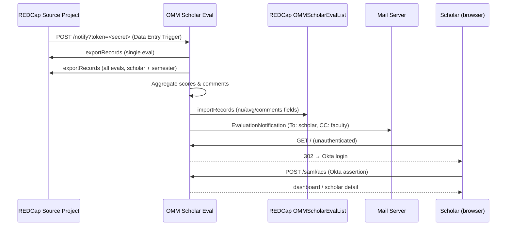

# OMM Scholar Eval

A Laravel 13 app that receives scholar evaluation submissions from REDCap, computes per-category grade aggregates, writes them back to a destination REDCap project, delivers email notifications to scholars and faculty, and exposes a dashboard protected by Okta SAML SSO.

---

## How It Works



---

## Stack

| Layer | Technology |
|-------|-----------|
| Framework | Laravel 13 / PHP 8.4 |
| Runtime | PHP-FPM + Nginx (Alpine) |
| Process manager | Supervisor |
| Reverse proxy | Traefik (external) |
| Database | MySQL 8 |
| Sessions / Cache / Queue | Database driver |
| Authentication | Okta SAML 2.0 via `onelogin/php-saml` |
| Authorization | App-level role enum (Service / Admin / Student) |
| Testing | Pest 4 — 94 tests |
| CI/CD | GitHub Actions |
| Containerisation | Docker (multi-stage) |
| Versioning | CalVer — `YYYY.HX.N` |

---

## Roles

| Role | Access |
|------|--------|
| **Service** | Everything — dashboard, all scholar records, `/process/*` bulk aggregation, `/admin/users` user management |
| **Admin** | Dashboard + all scholar records (read-only). No user management. |
| **Student** | Own scholar record only. Redirected from dashboard to their detail page. |

Service and Admin users are allowlisted by email in `.env` (`SERVICE_USERS=`, `ADMIN_USERS=`). Students auto-provision on first SAML login if their email matches a record in the REDCap destination project. Unmatched users see a 404.

---

## Documentation

| Guide | Description |
|-------|-------------|
| [Architecture](Docs/architecture.md) | System design, component breakdown, SAML + webhook data flows |
| [REDCap Integration](Docs/redcap-integration.md) | Source/destination schemas, webhook setup, field mappings |
| [Local Development](Docs/local-development.md) | Docker setup, environment variables, simulating SSO login |
| [Testing](Docs/testing.md) | Pest test suite, auth helpers, test structure |
| [Production Deployment](Docs/production.md) | CI/CD pipeline, CalVer tagging, Docker Hub, SSH deploy, Okta setup |
| [Security](Docs/security.md) | SAML validation, role model, webhook auth, secrets management |

---

## Quick Start

```bash
# 1. Clone and install dependencies
git clone <repo-url> omm-se && cd omm-se
composer install && npm install

# 2. Configure environment
cp .env.example .env
php artisan key:generate
# Edit .env: set DB_*, REDCAP_*, SAML_IDP_*, SERVICE_USERS

# 3. Start the local stack (app + MySQL + Mailhog)
docker compose up -d

# 4. Run migrations and seed the default Service account
php artisan migrate --seed

# 5. Run tests
php artisan test --compact
```

See [Local Development](Docs/local-development.md) for the full setup guide including how to bypass SAML for local development.

---

## Project Structure

```
app/
├── Enums/
│   └── Role.php                         # Service / Admin / Student
├── Http/
│   ├── Controllers/
│   │   ├── Admin/UserController.php     # Service-only user management UI
│   │   ├── Auth/SamlController.php      # SAML SSO (login / ACS / logout / metadata)
│   │   ├── DashboardController.php      # Cohort overview (Service + Admin)
│   │   ├── NotifierController.php       # REDCap webhook orchestrator
│   │   ├── ProcessController.php        # Bulk aggregation by PID (Service only)
│   │   └── ScholarController.php        # Scholar detail (scoped by role)
│   └── Middleware/
│       ├── RequireSamlAuth.php          # SAML session guard
│       └── VerifyWebhookToken.php       # Shared-secret webhook auth
├── Models/User.php
├── Providers/AppServiceProvider.php     # Gate definitions
└── Services/
    ├── SamlService.php                  # Role resolution + user provisioning
    ├── RedcapSourceService.php          # Current-year source project API
    └── RedcapDestinationService.php     # OMMScholarEvalList API

config/
├── redcap.php
└── saml.php

packages/redcap-advanced-link/          # Reusable REDCap Advanced Link template
                                        # (not wired into this app — copy-paste for other projects)
```
