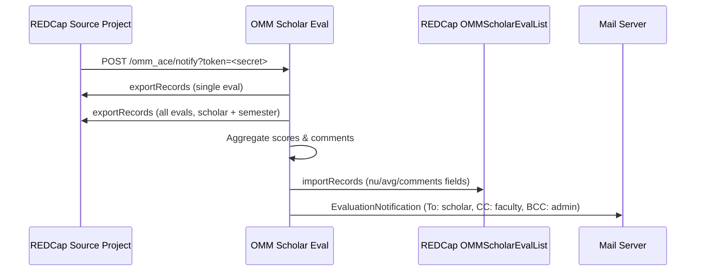

# OMM Scholar Eval

A Laravel 13 webhook processor that receives scholar evaluation submissions from REDCap, computes per-category grade aggregates, writes them back to a destination REDCap project, and delivers professional email notifications to scholars, faculty, and administrators.

---

## How It Works



---

## Stack

| Layer | Technology |
|-------|-----------|
| Framework | Laravel 13 / PHP 8.4 |
| Runtime | PHP-FPM + Nginx (Alpine) |
| Process manager | Supervisor |
| Reverse proxy | Traefik (external) |
| Cache | File-based |
| Queue | Sync (inline) |
| Testing | Pest 4 |
| CI/CD | GitHub Actions |
| Containerisation | Docker (multi-stage) |
| Versioning | CalVer — `YYYY.HX.N` |

---

## Documentation

| Guide | Description |
|-------|-------------|
| [Architecture](docs/architecture.md) | System design, component breakdown, data flow |
| [REDCap Integration](docs/redcap-integration.md) | Source/destination schemas, webhook setup, field mappings |
| [Local Development](docs/local-development.md) | Docker setup, environment variables, Mailhog |
| [Testing](docs/testing.md) | Pest test suite, running tests, test structure |
| [Production Deployment](docs/production.md) | CI/CD pipeline, CalVer tagging, Docker Hub, SSH deploy |
| [Security](docs/security.md) | Webhook auth, HTTPS enforcement, input validation |

---

## Quick Start

```bash
# 1. Clone and install dependencies
git clone <repo-url> omm-se && cd omm-se
composer install
cp .env.example .env
php artisan key:generate

# 2. Configure REDCap tokens and mail in .env
#    REDCAP_URL, REDCAP_TOKEN, REDCAP_SOURCE_TOKEN, WEBHOOK_SECRET

# 3. Start the local stack
docker compose up -d

# 4. Run tests
php artisan test --compact
```

See [Local Development](docs/local-development.md) for the full setup guide.

---

## Project Structure

```
app/
├── Http/
│   ├── Controllers/
│   │   └── NotifierController.php   # Webhook orchestrator
│   └── Middleware/
│       └── VerifyWebhookToken.php   # Shared-secret auth
├── Mail/
│   └── EvaluationNotification.php  # Markdown mailable
└── Services/
    ├── RedcapSourceService.php      # Current-year source project API wrapper
    └── RedcapDestinationService.php # OMMScholarEvalList API wrapper

config/redcap.php                    # REDCap connection config
resources/views/emails/evaluation.blade.php

docker/
├── entrypoint.sh
├── nginx/default.conf
├── php/{php.ini,opcache.ini}
└── supervisor/supervisord.conf

tests/
├── Feature/NotifierControllerTest.php
└── Unit/{RedcapSourceServiceTest,EvaluationNotificationTest}.php
```
